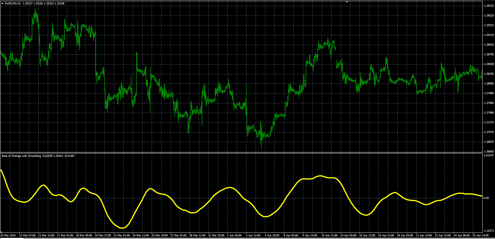

# Rate of Change with Smoothing

> Source: https://fxcodebase.com/code/viewtopic.php?f=38&t=60985  
> Forum: 38 · Topic 60985 · 1 post(s)

---

## Rate of Change with Smoothing

**Alexander.Gettinger** · Sun Jul 27, 2014 11:40 am

Original LUA oscillator: [viewtopic.php?f=17&t=60320](https://fxcodebase.com/code/viewtopic.php?f=17&t=60320).

 

Download:

 [ROC_With_Smoothing.mq4](files/95145/ROC_With_Smoothing.mq4)
