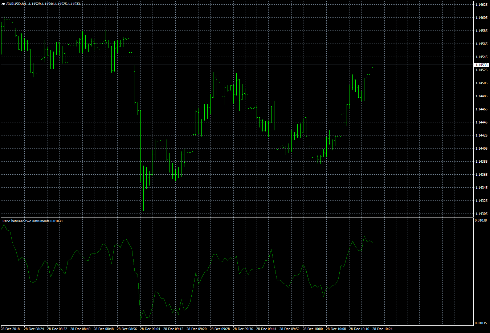

# Ratio between two instruments

> Source: https://fxcodebase.com/code/viewtopic.php?f=38&t=67214  
> Forum: 38 · Topic 67214 · 9 post(s)

---

## Ratio between two instruments

**Apprentice** · Fri Dec 28, 2018 7:49 am

 [Ratio between two instruments.mq4](files/123070/Ratio%20between%20two%20instruments.mq4)

MT4/Lua version.
[viewtopic.php?f=17&t=3810](https://fxcodebase.com/code/viewtopic.php?f=17&t=3810)

 [Ratio between two instruments normilized.mq4](files/123070/Ratio%20between%20two%20instruments%20normilized.mq4)

---

## Re: Ratio between two instruments

**logicgate** · Fri Dec 28, 2018 2:02 pm

Thanks brother, wishing you a happy new year!

---

## Re: Ratio between two instruments

**PURABI** · Tue Dec 22, 2020 9:22 am

If possible. Please normalize the indicator scale to 0-10

---

## Re: Ratio between two instruments

**Apprentice** · Wed Dec 23, 2020 3:19 am

Your request is added to the development list.
Development reference 2521.

---

## Re: Ratio between two instruments

**Apprentice** · Fri Dec 25, 2020 4:46 am

There is a Multiplier parameter for that.

Do you require something like this?
[viewtopic.php?f=17&t=23559](https://fxcodebase.com/code/viewtopic.php?f=17&t=23559)

---

## Re: Ratio between two instruments

**PURABI** · Fri Dec 25, 2020 10:27 am

> **Apprentice wrote:**
> There is a Multiplier parameter for that.
>
> Do you require something like this?
> [viewtopic.php?f=17&t=23559](https://fxcodebase.com/code/viewtopic.php?f=17&t=23559)

Yes sir,it will be helpful

---

## Re: Ratio between two instruments

**Apprentice** · Sat Dec 26, 2020 4:59 am

Your request is added to the development list.
Development reference 2533.

---

## Re: Ratio between two instruments

**Apprentice** · Sun Dec 27, 2020 3:25 pm

Ratio between two instruments normilized.mq4 added.

---

## Re: Ratio between two instruments

**Apprentice** · Sun Dec 27, 2020 3:25 pm

Ratio between two instruments normilized.mq4 added.
