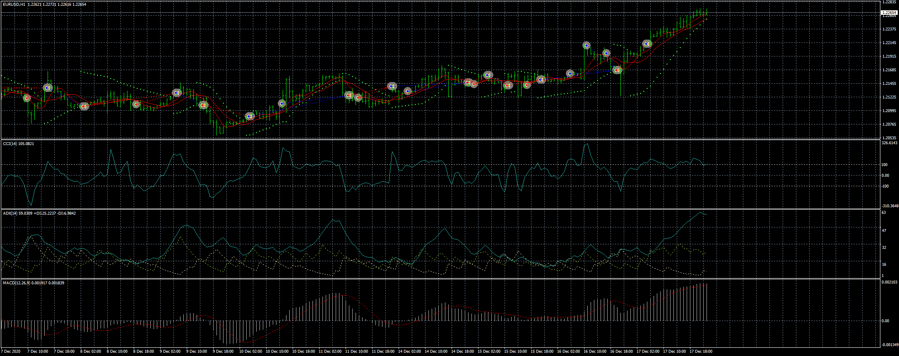

# real-time-multi-EA

> Source: https://fxcodebase.com/code/viewtopic.php?f=38&t=70938  
> Forum: 38 · Topic 70938 · 7 post(s)

---

## real-time-multi-EA

**Apprentice** · Wed Feb 17, 2021 11:04 am

Based on the request.
[viewtopic.php?f=27&t=70926](https://fxcodebase.com/code/viewtopic.php?f=27&t=70926)

 [real-time-multiindicator.mq4](files/140803/real-time-multiindicator.mq4)

 [real-time-multi-EA.mq4](files/140803/real-time-multi-EA.mq4)

TS2/Lua version.
[viewtopic.php?f=31&t=70954](https://fxcodebase.com/code/viewtopic.php?f=31&t=70954)

---

## Re: real-time-multi-EA

**chai88888** · Thu Feb 18, 2021 7:45 am

hi there can you please make a lua version of this strategy.

thanks

---

## Re: real-time-multi-EA

**Apprentice** · Fri Feb 19, 2021 1:29 pm

Your request is added to the development list.
Development reference 216.

---

## Re: real-time-multi-EA

**ElectricSavant** · Sat Feb 20, 2021 4:41 pm

What is lua?

> **chai88888 wrote:**
> hi there can you please make a lua version of this strategy.
>
> thanks

---

## Re: real-time-multi-EA

**Apprentice** · Mon Feb 22, 2021 3:28 am

Lua is a programing language.
FXCM TS2 indicators strategies are written in Lua.

---

## Re: real-time-multi-EA

**sdfx70** · Wed Feb 01, 2023 2:24 am

hi admin . trailing is't working on EA . can you please fix it
thanks

---

## Re: real-time-multi-EA

**Apprentice** · Wed Feb 01, 2023 3:51 am

We have added your request to the development list.
Development reference 108.
