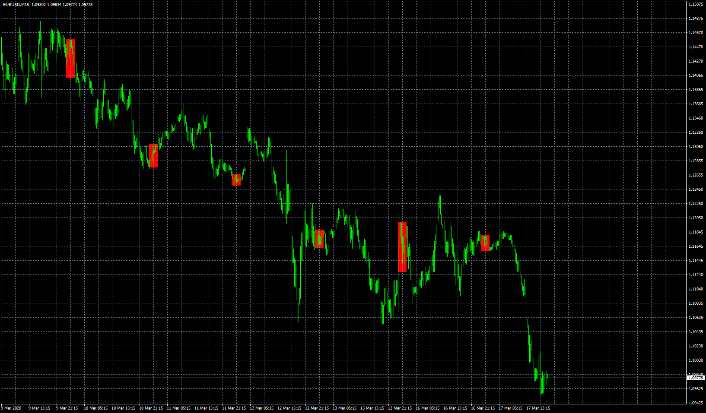

# Rectangle

> Source: https://fxcodebase.com/code/viewtopic.php?f=38&t=69712  
> Forum: 38 · Topic 69712 · 13 post(s)

---

## Rectangle

**Apprentice** · Wed Apr 22, 2020 11:35 am

Based on request.
[viewtopic.php?f=27&t=69671](https://fxcodebase.com/code/viewtopic.php?f=27&t=69671)

 [Rectangle.mq4](files/133072/Rectangle.mq4)

---

## Re: Rectangle

**tmue2014** · Thu Apr 23, 2020 11:18 pm

Hi Apprentice.... Thank you very much for coding the above...

Your time permitting....

Could you code an additional option to represent HH & LL just as lines (color as an user option) that also shows the value of HH / LL at the end of the lines, Lines not to go beyond Last Bar give in options... same as done with rectangle....

Thanks in advance!

---

## Re: Rectangle

**Apprentice** · Fri Apr 24, 2020 12:58 pm

Your request is added to the development list.
Development reference 1128.

---

## Re: Rectangle

**tmue2014** · Tue Apr 28, 2020 11:27 pm

Thank you very much for entertaining my request....

Looking at this more closely, it seems that neither indicators actually captures the correct values for the first candle... To better illustrate this, see attached screenshot on M15... indicator is set to 02:00:00 with 9 candles but the captured value (LL in this case) is actually for CandleOpen at 02:15....

If it is not too much trouble, could you also please move the text label inline with HH / LL line but a bit further to the right (as shown with Daily Open Line - I only have the ex4 for that so cant modify myself...)

Thanks for your consideration

---

## Re: Rectangle

**tmue2014** · Wed Apr 29, 2020 7:34 am

Hi Apprentice,

one further issue became apparent - the lines do not stop after the reaching the defined number of candles....

Thanks for fixing this!

---

## Re: Rectangle

**Apprentice** · Thu Apr 30, 2020 4:11 am

Your request is added to the development list.
Development reference 1175.

---

## Re: Rectangle

**Apprentice** · Thu May 07, 2020 7:01 am

Try it now.

---

## Re: Rectangle

**tmue2014** · Fri May 08, 2020 12:23 am

Thank you very much for your effort but I am sorry that neither Rectangle nor HH-LL correctly captures the correct value in case the first candle in the sequence is either the LL or the HH... I have attached two images for HH-LL to show the two cases, u can see same case for Rectangle...

Your time permitting, could you look at it once more.

Thks a lot

---

## Re: Rectangle

**Apprentice** · Fri May 08, 2020 5:21 am

Your request is added to the development list.
Development reference 1246.

---

## Re: Rectangle

**Apprentice** · Fri May 15, 2020 7:41 am

[HH-LL Lines.mq4](files/133962/HH-LL%20Lines.mq4)

 [Rectangle.mq4](files/133962/Rectangle.mq4)

Try this versions.

---

## Re: Rectangle

**tmue2014** · Fri May 15, 2020 10:26 pm

Thank you very much for fixing these two indicators... they now work as intended....

Much appreciated!!

---

## Re: Rectangle

**evansrono** · Fri Dec 02, 2022 12:49 am

Hi
For the HH-LL, could you modify to draw these lines when the rectangle candles are at rounding off numbers (rule of 5). eg 50 pips, 25 pips steps. These lines drawn from the last x number of days to present End Of Day. Thanks.

Regards

---

## Re: Rectangle

**Apprentice** · Mon Dec 05, 2022 6:15 am

We have added your request to the development list.
Development reference 804.
