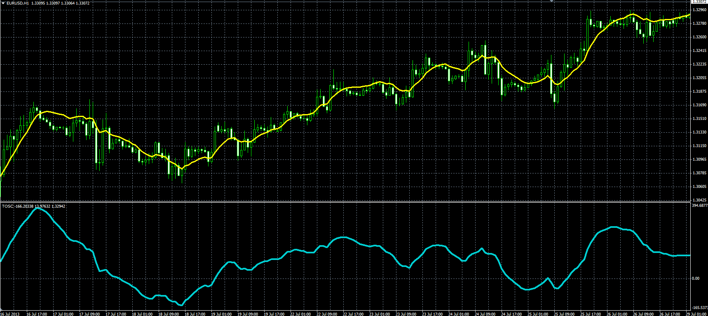

# Recursive Trendline and TOSC

> Source: https://fxcodebase.com/code/viewtopic.php?f=38&t=59085  
> Forum: 38 · Topic 59085 · 1 post(s)

---

## Recursive Trendline and TOSC

**Alexander.Gettinger** · Tue Aug 13, 2013 2:08 pm

Original LUA indicators: [viewtopic.php?f=17&t=46409](https://fxcodebase.com/code/viewtopic.php?f=17&t=46409).

Formulas:
RTL[i] = (1-Alpha)*RTL[i-1]+Alpha*(Price[i]+b0[i]-b0[i-1]),
TOSC[i] = (RTL[i]-EMA(Length, Price)), where
b0[i] = (1-Alpha)*b0[i-1]+Price[i].

 

Download:

 [RTL.mq4](files/88512/RTL.mq4)

 [TOSC.mq4](files/88512/TOSC.mq4)
