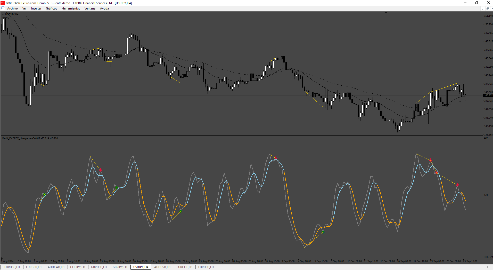
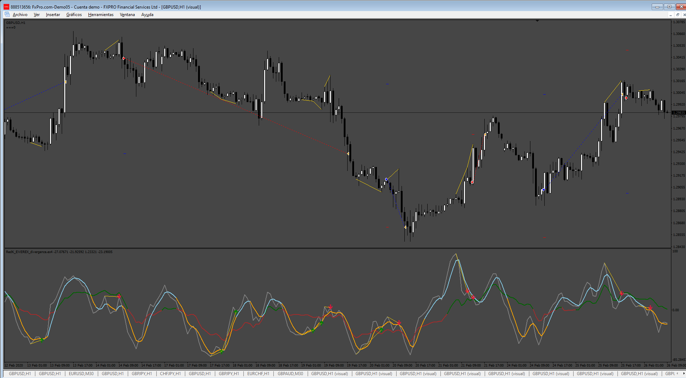

# RedK_EVEREX_divergence

> Source: https://fxcodebase.com/code/viewtopic.php?f=38&t=75235  
> Forum: 38 · Topic 75235 · 5 post(s)

---

## RedK_EVEREX_divergence

**Apprentice** · Fri Sep 27, 2024 6:26 am

Based on the request.
[https://fxcodebase.com/code/viewtopic.p ... 58#p156658](https://fxcodebase.com/code/viewtopic.php?f=27&p=156658#p156658)

 [RedK_EVEREX_divergence.mq4](files/156803/RedK_EVEREX_divergence.mq4)

---

## Re: RedK_EVEREX_divergence

**trtrader** · Fri Sep 27, 2024 9:19 am

Thanks but can we have settings to adjust how many last tops or bottoms to will be used for calculations?

Also could you please create an EA?

---

## Re: RedK_EVEREX_divergence

**quintana** · Sat Sep 28, 2024 9:51 am

really not repaint
can you make an ea based on arrows
thanks

---

## Re: RedK_EVEREX_divergence

**Apprentice** · Tue Oct 01, 2024 5:31 am

We have added your request to the development list.
Development reference 745

---

## Re: RedK_EVEREX_divergence

**Apprentice** · Sun Oct 06, 2024 2:58 am

 [RedK_EVEREX_divergence_EA.mq4](files/156884/RedK_EVEREX_divergence_EA.mq4)
