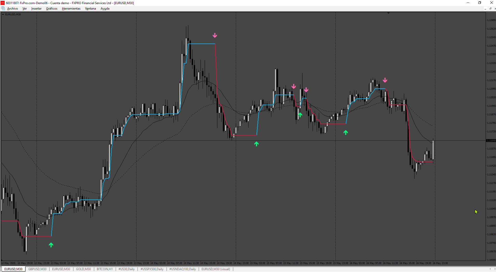

# redraw

> Source: https://fxcodebase.com/code/viewtopic.php?f=38&t=75942  
> Forum: 38 · Topic 75942 · 4 post(s)

---

## redraw

**Apprentice** · Sat May 17, 2025 10:36 am

Based on the request.
[https://fxcodebase.com/code/viewtopic.p ... 84#p158984](https://fxcodebase.com/code/viewtopic.php?f=27&p=158984#p158984)

 [redraw.mq4](files/159264/redraw.mq4)

---

## Re: redraw

**Frans88** · Mon May 19, 2025 4:58 pm

can you make this indicator non repaint?

---

## Re: redraw

**Apprentice** · Sat May 24, 2025 2:52 pm

We have added your request to the development list.
Development reference 357

---

## Re: redraw

**Apprentice** · Wed Jul 02, 2025 4:16 pm

[redraw_v2.mq4](files/159827/redraw_v2.mq4)

“How many bars to confirm trend before showing arrow” option added?
