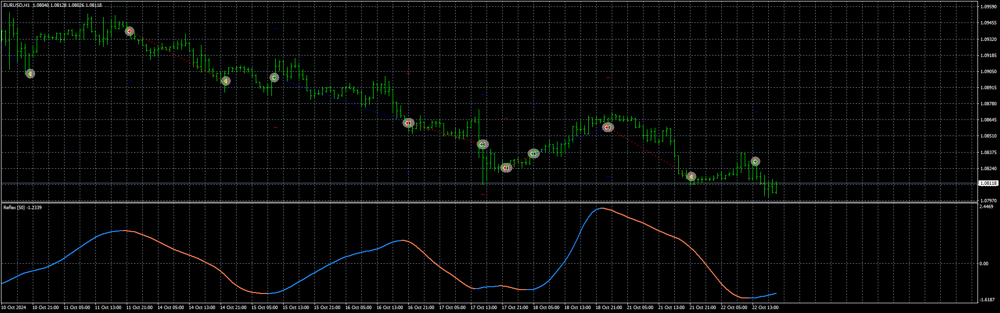
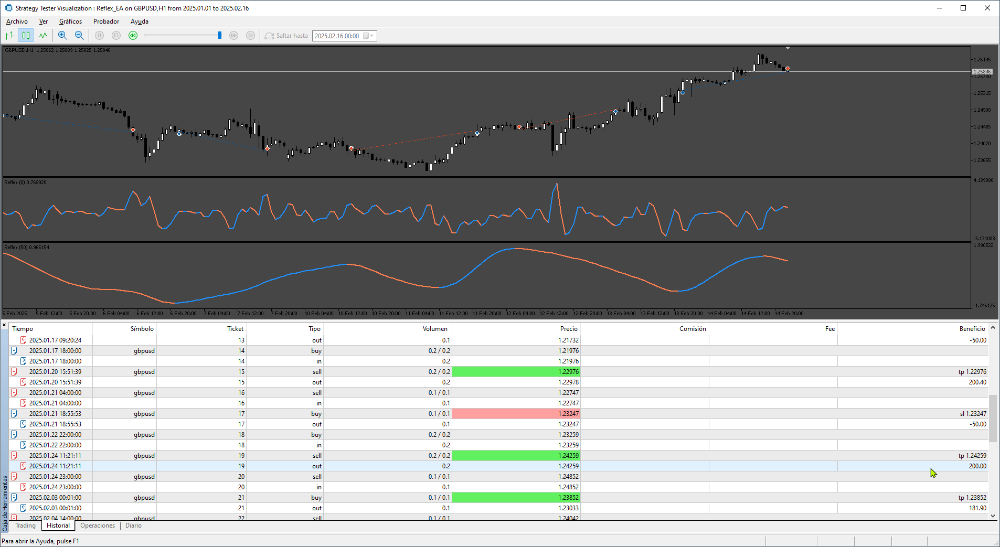

# Reflex_EA_v1,00

> Source: https://fxcodebase.com/code/viewtopic.php?f=38&t=75299  
> Forum: 38 · Topic 75299 · 7 post(s)

---

## Reflex_EA_v1,00

**Apprentice** · Tue Oct 22, 2024 11:51 am

Based on the request.
[https://fxcodebase.com/code/viewtopic.php?f=38&t=75256](https://fxcodebase.com/code/viewtopic.php?f=38&t=75256)

 [Reflex.mq4](files/157053/Reflex.mq4)

 [Reflex_EA_v1,00.mq4](files/157053/Reflex_EA_v100.mq4)

---

## Re: Reflex_EA_v1,00

**VuxxLong** · Thu Oct 24, 2024 9:53 pm

Can we please have this EA for MT5 too?

---

## Re: Reflex_EA_v1,00

**Apprentice** · Thu Oct 31, 2024 8:44 am

We have added your request to the development list.
Development reference 819

---

## Re: Reflex_EA_v1,00

**Apprentice** · Sun Nov 10, 2024 3:38 pm

 [Reflex.mq5](files/157236/Reflex.mq5)

 [Reflex_EA.mq5](files/157236/Reflex_EA.mq5)

---

## Re: Reflex_EA_v1,00

**gomezM** · Mon Feb 17, 2025 7:28 am

I'm Testing the MT5 version looks better, just could you add a martingale system? (when lose a trade the next is for the double lots)
thanks

---

## Re: Reflex_EA_v1,00

**Apprentice** · Mon Feb 17, 2025 1:08 pm

We have added your request to the development list.
Development reference 113

---

## Re: Reflex_EA_v1,00

**Apprentice** · Wed Feb 19, 2025 7:06 am

 [Reflex_EA.mq5](files/158318/Reflex_EA.mq5)
