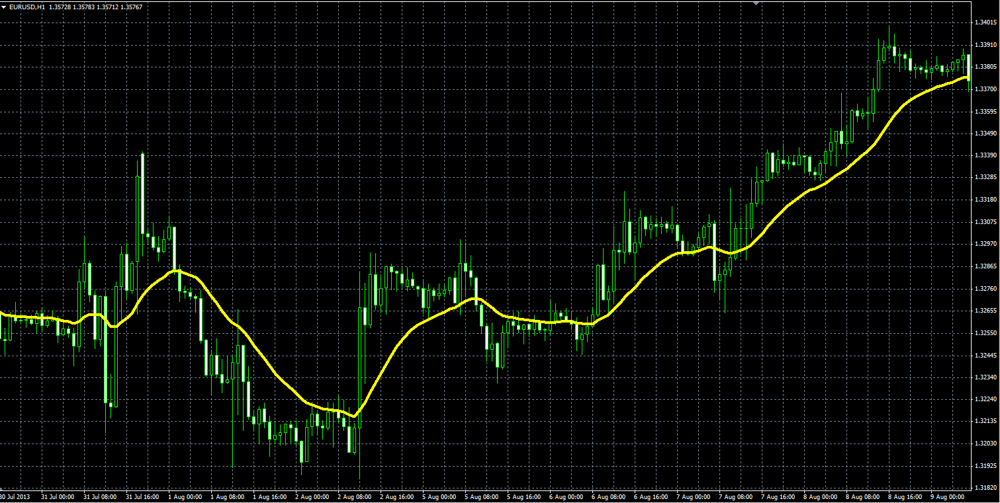

# Regularized EMA by Chris Satchwell

> Source: https://fxcodebase.com/code/viewtopic.php?f=38&t=59636  
> Forum: 38 · Topic 59636 · 1 post(s)

---

## Regularized EMA by Chris Satchwell

**Alexander.Gettinger** · Wed Oct 09, 2013 5:34 pm

Formulas:
REMA[i] = (REMA[i-1]*(1+2*Lambda)+Alpha*(Price[i]-REMA[i-1])-Lambda*REMA[i-2])/(1+Lambda), where
Alpha=2/(Length+1),
Lambda=0.5.

 

Download:

 [REMA.mq4](files/89928/REMA.mq4)
