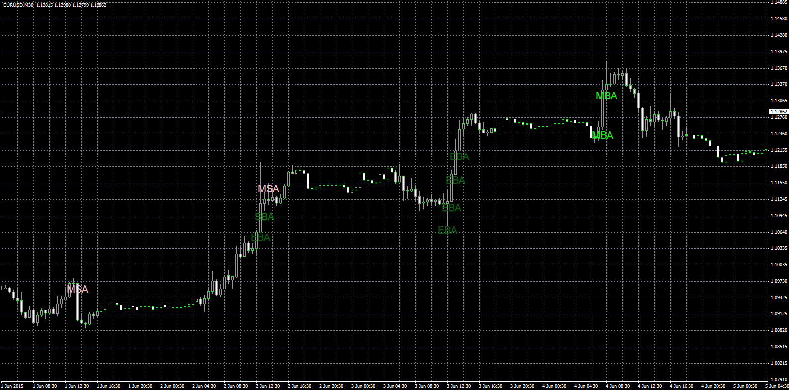

# Relative Aggression Bars

> Source: https://fxcodebase.com/code/viewtopic.php?f=38&t=62366  
> Forum: 38 · Topic 62366 · 5 post(s)

---

## Relative Aggression Bars

**Apprentice** · Sun Jun 28, 2015 8:09 am

Based lua original.
[viewtopic.php?f=17&t=34335](https://fxcodebase.com/code/viewtopic.php?f=17&t=34335)

Mods
0 - A. Volume
1 - ATR
2 - Volume
3 - A. ATR
4 - Percentage

Legend
MBA - Moderate_Buying_Aggression = Lime;
SBA -Strong_Buying_Aggression = Green;
EBA -Extrem_Buying_Aggression = DarkGreen;

MSA -Moderate_Selling_Aggression = Pink;
SSA -Strong_Selling_Aggression = Red;
ESA -Extrem_Selling_Aggression = Maroon;

 [Relative Aggression Bars.mq4](files/101178/Relative%20Aggression%20Bars.mq4)

---

## Re: Relative Aggression Bars

**GFTMATRIX** · Tue Jun 30, 2015 11:25 am

Hi

This indicator looks good . it could be much better if the candle shown as in lua indicator .

---

## Re: Relative Aggression Bars

**GFTMATRIX** · Tue Jun 30, 2015 8:10 pm

Hi

This Relative aggressive bar indicator is really good . It could be much better if the charts looks like as Lua indicator ..i attached zone indicator for your reference

---

## Re: Relative Aggression Bars

**Apprentice** · Mon Jul 06, 2015 4:25 am

In the example, we color code only 3 colors , for that we need 8 output stream.
For Relative Aggression Bars we need six colors, 16 output stream.
MT4 limit is 8 output stream.
Can you advise ..

---

## Re: Relative Aggression Bars

**Artem.dev** · Mon Sep 10, 2018 2:46 am

> **Apprentice wrote:**
> In the example, we color code only 3 colors , for that we need 8 output stream.
> For Relative Aggression Bars we need six colors, 16 output stream.
> MT4 limit is 8 output stream.
> Can you advise ..

Now MT4 limit is 512 output stream.
