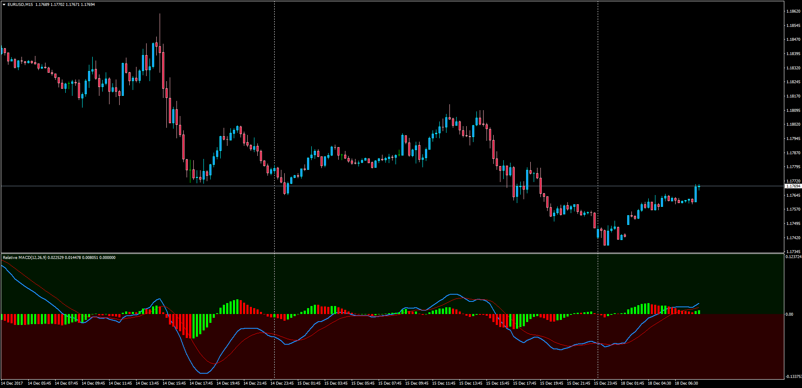

# Relative MACD

> Source: https://fxcodebase.com/code/viewtopic.php?f=38&t=65466  
> Forum: 38 · Topic 65466 · 1 post(s)

---

## Relative MACD

**Apprentice** · Tue Dec 19, 2017 4:56 am

LUA Original: [viewtopic.php?f=17&t=3203](https://fxcodebase.com/code/viewtopic.php?f=17&t=3203)

Description:

In this MT4 version of the LUA Original "Relative MACD" there is also a background color for each side of the zero line.

The indicator consists of:

MACD in %
MACD: (short EMA - long MA) / ( long MA /100)

This indicator has the option to display the MACD lines in the percentage.

 [Relative_MACD.mq4](files/116545/Relative_MACD.mq4)
