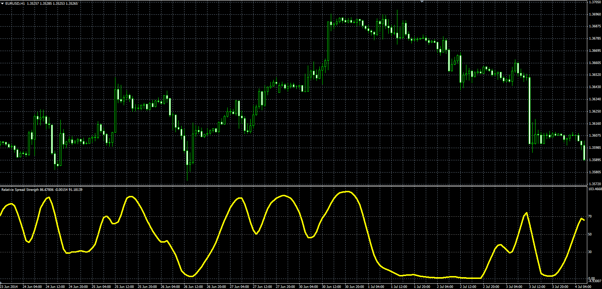

# Relative Spread Strength

> Source: https://fxcodebase.com/code/viewtopic.php?f=38&t=61058  
> Forum: 38 · Topic 61058 · 1 post(s)

---

## Relative Spread Strength

**Alexander.Gettinger** · Wed Aug 20, 2014 10:01 am

Original LUA oscillators: [viewtopic.php?f=17&t=60079](https://fxcodebase.com/code/viewtopic.php?f=17&t=60079).

Formula:
RSS = MVA(RSI, Smoothing_Length), where
RSI = RSI(Short_EMA(Price)-Long_EMA(Price)).

 

Download:

 [RSS.mq4](files/95444/RSS.mq4)

 [Rapid_RSI.mq4](files/95444/Rapid_RSI.mq4)
