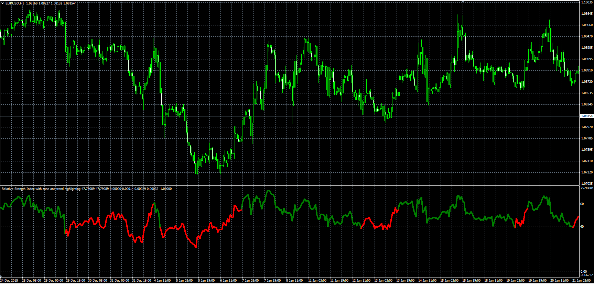

# Relative Stength Index with oversold and overbought zones

> Source: https://fxcodebase.com/code/viewtopic.php?f=38&t=63062  
> Forum: 38 · Topic 63062 · 1 post(s)

---

## Relative Stength Index with oversold and overbought zones

**Alexander.Gettinger** · Mon Jan 25, 2016 9:08 am

Download:

 [RSI_PK.mq4](files/104415/RSI_PK.mq4)
