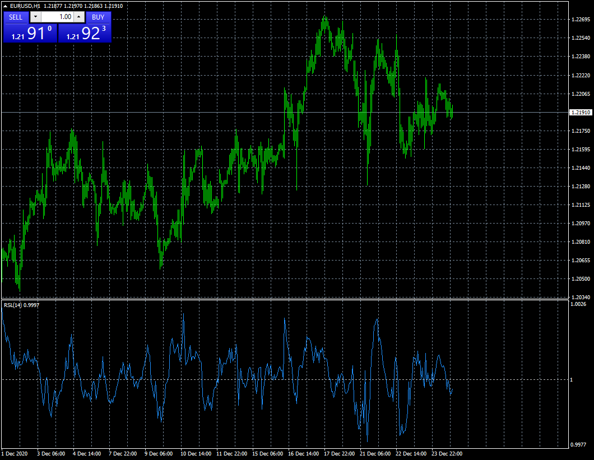

# Relative Strength Levy TFS

> Source: https://fxcodebase.com/code/viewtopic.php?f=38&t=70749  
> Forum: 38 · Topic 70749 · 2 post(s)

---

## Relative Strength Levy TFS

**Apprentice** · Thu Dec 24, 2020 9:14 am

Based on request.
[viewtopic.php?f=38&t=70741](https://fxcodebase.com/code/viewtopic.php?f=38&t=70741)

 [Relative Strength Levy TFS.mq4](files/139771/Relative%20Strength%20Levy%20TFS.mq4)

---

## Re: Relative Strength Levy TFS

**alienfriend18** · Sun Feb 21, 2021 7:22 am

Indicator is not updating in time...lagging
