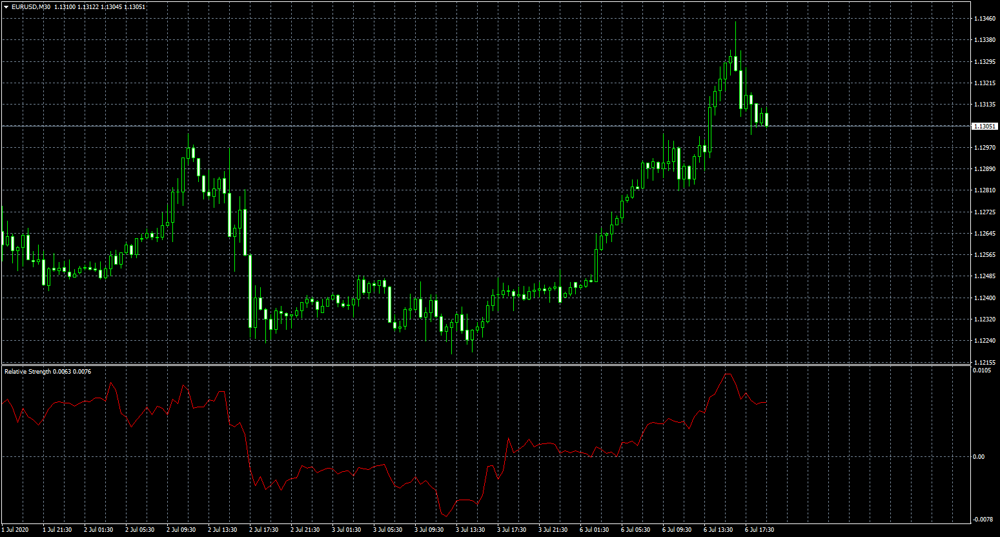

# Relative Strength

> Source: https://fxcodebase.com/code/viewtopic.php?f=38&t=70132  
> Forum: 38 · Topic 70132 · 5 post(s)

---

## Relative Strength

**Apprentice** · Mon Jul 06, 2020 1:46 pm

Based on request.
[viewtopic.php?f=27&t=70123](https://fxcodebase.com/code/viewtopic.php?f=27&t=70123)

 [Relative Strength.mq4](files/135674/Relative%20Strength.mq4)

 [Relative Strength Normilized.mq4](files/135674/Relative%20Strength%20Normilized.mq4)

 [Relative_Strength_Normilized_Dashboard.mq4](files/135674/Relative_Strength_Normilized_Dashboard.mq4)

---

## Re: Relative Strength

**PURABI** · Fri Feb 26, 2021 12:10 pm

Please normalize the indicator between -1 and 1 or 0-1 or 0-100. whichever is good

---

## Re: Relative Strength

**Apprentice** · Sat Feb 27, 2021 4:13 am

Your request is added to the development list.
Development reference 236.

---

## Re: Relative Strength

**Apprentice** · Wed Mar 03, 2021 1:17 pm

Relative Strength Normilized.mq4 added.

---

## Re: Relative Strength

**alienfriend18** · Mon Oct 04, 2021 12:07 pm

Just like relative strength....want relative strength of volume...that compare volume strength with another symbol
