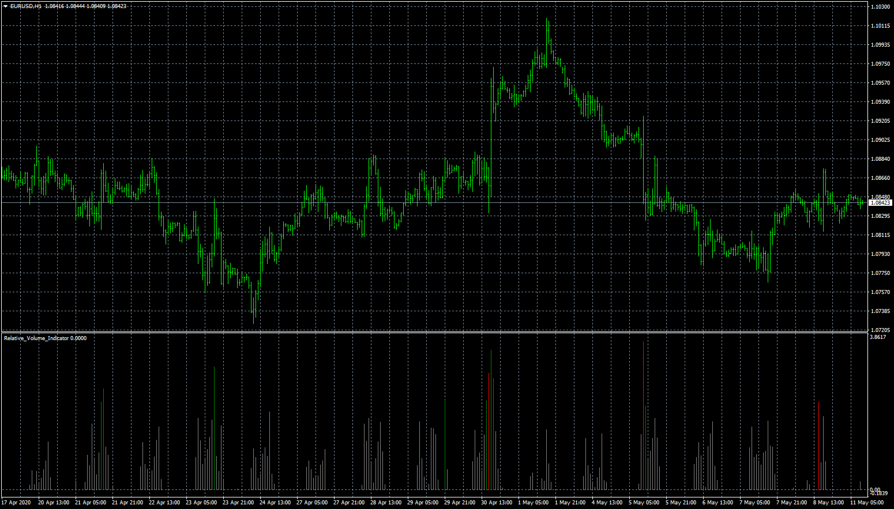
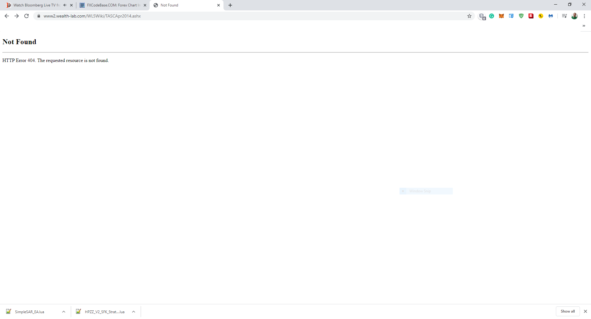
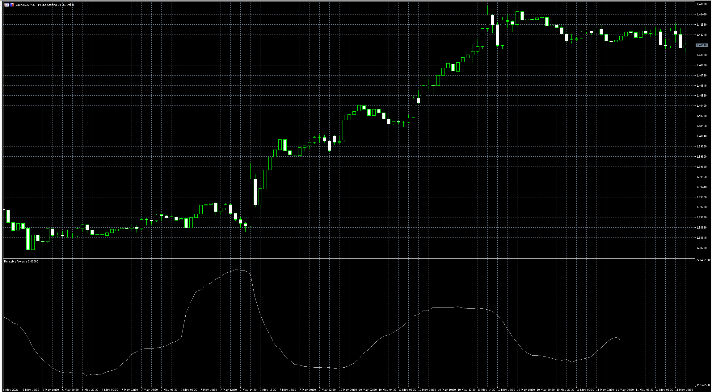

# Relative_Volume_Indicator

> Source: https://fxcodebase.com/code/viewtopic.php?f=38&t=69838  
> Forum: 38 · Topic 69838 · 17 post(s)

---

## Relative_Volume_Indicator

**Apprentice** · Mon May 11, 2020 3:51 am

Based on request.
[viewtopic.php?f=38&t=69823](https://fxcodebase.com/code/viewtopic.php?f=38&t=69823)

 [Relative_Volume_Indicator.mq4](files/133797/Relative_Volume_Indicator.mq4)

---

## Re: Relative_Volume_Indicator

**aladdin007** · Mon May 11, 2020 1:53 pm

Thank you so much Mr Mario apprentice
Can you please add an auto S/R drawing indicator on chart based on this script please
Ex in picture ,thank you so much

---

## Re: Relative_Volume_Indicator

**Apprentice** · Tue May 12, 2020 11:20 am

Can you provide the script?

---

## Re: Relative_Volume_Indicator

**aladdin007** · Tue May 12, 2020 2:51 pm

Can you please check if it’s this one
Thank you so much
[http://www2.wealth-lab.com/WL5Wiki/TASCApr2014.ashx](http://www2.wealth-lab.com/WL5Wiki/TASCApr2014.ashx)

---

## Re: Relative_Volume_Indicator

**Apprentice** · Wed May 13, 2020 3:17 am

---

## Re: Relative_Volume_Indicator

**aladdin007** · Wed May 13, 2020 6:54 am

using System;
using System.Collections.Generic;
using System.Text;
using System.Drawing;
using WealthLab;
using WealthLab.Indicators;
using TASCIndicators;

namespace WealthLab.Strategies
{
	public class MyStrategy : WealthScript
	{
 protected override void Execute()
 {
 int period = 60;
 double d = 2;
 DataSeries relVol = Close*0; relVol.Description = "Relative Volume";
 DataSeries theFoM = Volume*0;	theFoM.Description = "Freedom of Movement";

 for(int bar = 0; bar < Bars.Count; bar++)
 {
 relVol[bar] = RelVol.Series(Bars,period)[bar] > 0 ? RelVol.Series(Bars,period)[bar] : 0;
 theFoM[bar] = FOM.Series(Bars,period)[bar] > 0 ? FOM.Series(Bars,period)[bar] : 0;
 }

 HideVolume();
 ChartPane r = CreatePane( 30,false,true );
 PlotSeries( r, relVol, Color.Black, LineStyle.Histogram, 3 );
 ChartPane f = CreatePane( 30,false,true );
 PlotSeries( f, theFoM, Color.Black, LineStyle.Histogram, 3 );

 for(int bar = 1; bar < Bars.Count; bar++)
 {
 if (relVol[bar] <= d)
 SetSeriesBarColor( bar, relVol, Color.DarkGray);
 if (theFoM[bar] < d)
 SetSeriesBarColor( bar, theFoM, Color.DarkGray);

 if (theFoM[bar] > d || relVol[bar] > d) // Draw DPLs
 {
 DrawLine(PricePane,bar,Close[bar],Bars.Count-1,Close[bar],Color.Blue,LineStyle.Solid,1);
 }

---

## Re: Relative_Volume_Indicator

**Apprentice** · Wed May 13, 2020 8:50 am

Your request is added to the development list.
Development reference 1286.

---

## Re: Relative_Volume_Indicator

**Apprentice** · Thu May 14, 2020 6:52 am

This code doesn't have the required formulae.
It plots RelVol and FOM indicators in a single indicator.
 I need the code of RelVol and FOM

---

## Re: Relative_Volume_Indicator

**aladdin007** · Thu May 14, 2020 2:44 pm

Thank you so much for all the help Mr Mario apprentice
This all what I get from the search

[https://forum.esignal.com/forum/efs-dev ... e-dickover](https://forum.esignal.com/forum/efs-development/efs-library-discussion-board/stocks-commodities-magazine/40605-2014-july-apr-evidence-based-support-resistance-by-melvin-e-dickover)

I hope can auto plot the Lines of SR line in chart

Thank you so much for help
My god bless you

---

## Re: Relative_Volume_Indicator

**aladdin007** · Thu May 21, 2020 12:11 pm

Is that the right code Mr Mario apprentice ?

---

## Re: Relative_Volume_Indicator

**Apprentice** · Fri May 22, 2020 6:39 am

Try this version.
[viewtopic.php?f=38&t=69897](https://fxcodebase.com/code/viewtopic.php?f=38&t=69897)

---

## Re: Relative_Volume_Indicator

**logicgate** · Sun Feb 07, 2021 3:12 pm

hi there dear friend,

Can we have a Relative Volume Indicator for MT5 please?

---

## Re: Relative_Volume_Indicator

**logicgate** · Sun Feb 07, 2021 3:16 pm

Complementing my previous message:

I don´t know the formula you used in this one, but if you could take a look here:

[https://stockbeep.com/how-to-calculate- ... ay-trading](https://stockbeep.com/how-to-calculate-relative-volume-rvol-for-intraday-trading)

It also explains how to do it properly for use it intraday.

So in the MT5 version we could have the option in the indicator settings:

Intraday - True/False

If set to "false", then we should use the indicator in higher timeframes (daily, weekly), if set to "true", then obviously use the intraday version as explained in the link provided.

---

## Re: Relative_Volume_Indicator

**Apprentice** · Sun Feb 07, 2021 6:28 pm

Your request is added to the development list.
Development reference 164.

---

## Re: Relative_Volume_Indicator

**MarketMage** · Sat Feb 13, 2021 12:14 pm

Was this ever developed? Cant find an MT4 relative volume indicator anywhere. Thank you!

---

## Re: Relative_Volume_Indicator

**Apprentice** · Tue May 11, 2021 3:42 am

 [Relative_volume.mq5](files/142003/Relative_volume.mq5)

Try this version.

---

## Re: Relative_Volume_Indicator

**logicgate** · Tue May 11, 2021 5:15 am

Hi there dear friend, I tested here and it doesn´t look anything like the MT4 version screeenshot you posted on OP.

This data is better interpreted with a histogram.
