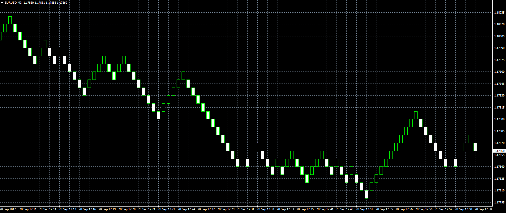

# Renko chart

> Source: https://fxcodebase.com/code/viewtopic.php?f=38&t=65126  
> Forum: 38 · Topic 65126 · 3 post(s)

---

## Renko chart

**Alexander.Gettinger** · Thu Sep 28, 2017 11:53 am

The indicator creates an offline Renko chart.
The parameter [RenkoTimeFrame] specifies the name of the offline chart.

 

Download:

 [Renko_Offline.mq4](files/115132/Renko_Offline.mq4)

Offline Charts in MetaTrader 4 Terminal
[https://www.mql5.com/en/articles/1387](https://www.mql5.com/en/articles/1387)

---

## Re: Renko chart

**easytrading** · Sun Apr 12, 2020 6:29 pm

Hello Apprentice,

I download this indicator to my MT4 but i couldn't attach it to the EUR/USD 1M chart using the same way of attaching the indicators to the MT4 chart . please, could you guide me in steps how to open a Renko chart using this indicator ?

your help is highly appreciated .

---

## Re: Renko chart

**Apprentice** · Mon Apr 13, 2020 3:52 am

Offline Charts in MetaTrader 4 Terminal
[https://www.mql5.com/en/articles/1387](https://www.mql5.com/en/articles/1387)
