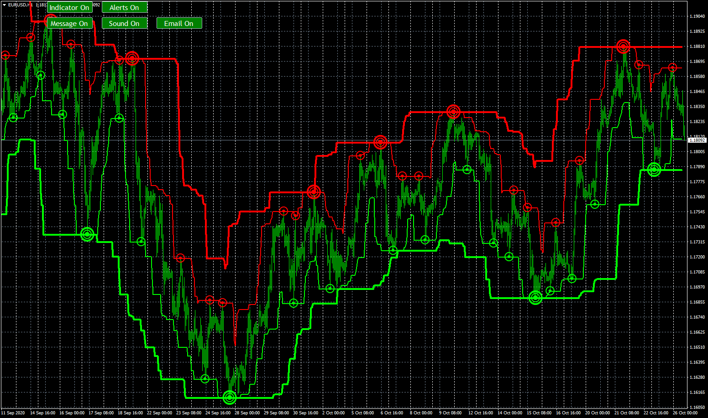

# Renko_Super-signals

> Source: https://fxcodebase.com/code/viewtopic.php?f=38&t=70565  
> Forum: 38 · Topic 70565 · 10 post(s)

---

## Renko_Super-signals

**Apprentice** · Mon Oct 26, 2020 4:19 am

Based on request.
[viewtopic.php?f=27&t=70544](https://fxcodebase.com/code/viewtopic.php?f=27&t=70544)

 [Renko_Super-signals.mq4](files/138474/Renko_Super-signals.mq4)

 [Non Repaint Renko_Super-signals.mq4](files/138474/Non%20Repaint%20Renko_Super-signals.mq4)

---

## Re: Renko_Super-signals

**planstyr** · Mon Oct 26, 2020 9:00 am

**Apprentice** can you make it No Repaint, please!

---

## Re: Renko_Super-signals

**planstyr** · Mon Oct 26, 2020 9:01 am

Apprentice, can you make it No Repaint?

---

## Re: Renko_Super-signals

**stefanoste** · Mon Oct 26, 2020 7:12 pm

Thank you so much, but the on/off button doesn't seem to be working can you please check, also there no need for the other buttons so can you please remove it

Thank you

---

## Re: Renko_Super-signals

**Apprentice** · Tue Oct 27, 2020 7:22 am

Your request is added to the development list.
Development reference 2226.

---

## Re: Renko_Super-signals

**Apprentice** · Mon Nov 02, 2020 3:20 am

Fixed.

---

## Re: Renko_Super-signals

**stefanoste** · Mon Nov 02, 2020 10:21 am

> **Apprentice wrote:**
> Fixed.

thank you

---

## Re: Renko_Super-signals

**Apprentice** · Sat Aug 12, 2023 3:02 am

Non Repaint Renko_Super-signals.mq4 added.

---

## Re: Renko_Super-signals

**rickCreations** · Mon Aug 14, 2023 12:44 am

> **Apprentice wrote:**
> Non Repaint Renko_Super-signals.mq4 added.

Array out of range error

Code: [Select all](https://fxcodebase.com/code/)
`b1[i] = EMPTY_VALUE;   
in the void draw() section`

---

## Re: Renko_Super-signals

**Apprentice** · Wed Aug 16, 2023 2:45 pm

We have added your request to the development list.
Development reference 720.
