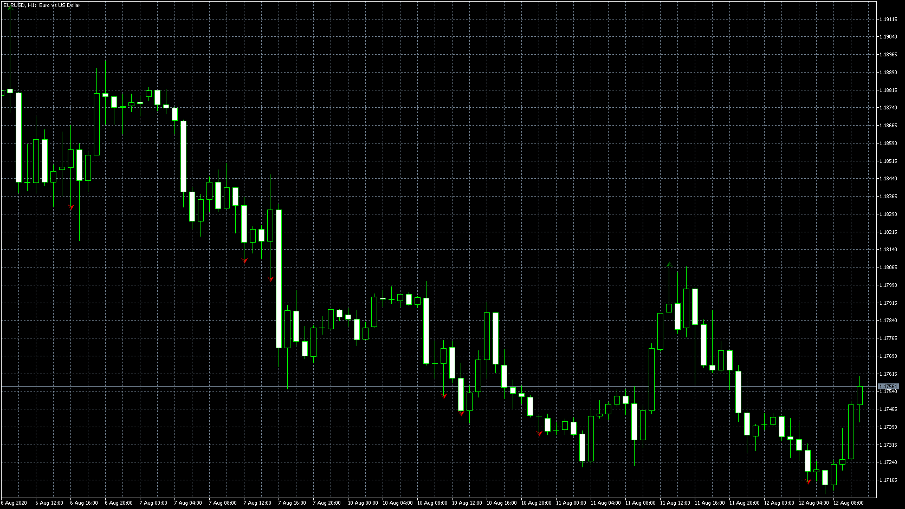

# RenkoScalp_DotNRP EA

> Source: https://fxcodebase.com/code/viewtopic.php?f=38&t=70289  
> Forum: 38 · Topic 70289 · 4 post(s)

---

## RenkoScalp_DotNRP EA

**Apprentice** · Wed Aug 12, 2020 5:20 am

Based on request.
[viewtopic.php?f=27&t=70154](https://fxcodebase.com/code/viewtopic.php?f=27&t=70154)

 [RenkoScalp_DotNRP.mq5](files/136806/RenkoScalp_DotNRP.mq5)

 [RenkoScalp_DotNRP EA.mq5](files/136806/RenkoScalp_DotNRP%20EA.mq5)

---

## Re: RenkoScalp_DotNRP EA

**forextraderaz** · Wed Aug 12, 2020 1:54 pm

Hi,

The EA doesn't open any trades it is saying invalid stops under the experts tab.

---

## Re: RenkoScalp_DotNRP EA

**Apprentice** · Thu Aug 13, 2020 6:04 am

Your request is added to the development list.
Development reference 1881.

---

## Re: RenkoScalp_DotNRP EA

**Apprentice** · Fri Sep 04, 2020 2:48 am

I don't have any issues. It's likely the stop loss set in your parameters is invalid for the instrument you are using. You need to change the stop loss
