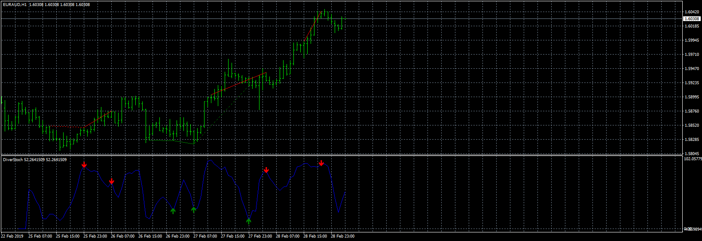

# RenkoScalp_DotNRP EA

> Source: https://fxcodebase.com/code/viewtopic.php?f=38&t=70176  
> Forum: 38 · Topic 70176 · 11 post(s)

---

## RenkoScalp_DotNRP EA

**Apprentice** · Tue Jul 14, 2020 7:49 am

Based on request.
[viewtopic.php?f=27&t=70154&p=135869&hilit=1675#p135869](https://fxcodebase.com/code/viewtopic.php?f=27&t=70154&p=135869&hilit=1675#p135869)

 [DiverStoch.mq4](files/135955/DiverStoch.mq4)

 [RenkoScalp_DotNRP.mq4](files/135955/RenkoScalp_DotNRP.mq4)

 [RenkoScalp_DotNRP EA.mq4](files/135955/RenkoScalp_DotNRP%20EA.mq4)

---

## Re: RenkoScalp_DotNRP EA

**taipan** · Wed Jul 15, 2020 8:54 pm

Hi Apprendice, I have loaded this RenkoScalp_DotNRP EA on chart and the error message is asking for the indicator to be loaded, where is the RenkoScalp_DotNRP indicator and where i can find it in this website?

taipan

---

## Re: RenkoScalp_DotNRP EA

**Apprentice** · Thu Jul 16, 2020 4:15 am

Your request is added to the development list.
Development reference 1709.

---

## Re: RenkoScalp_DotNRP EA

**Apprentice** · Thu Jul 16, 2020 5:58 am

RenkoScalp_DotNRP.mq4 added.

---

## Re: RenkoScalp_DotNRP EA

**taipan** · Thu Jul 16, 2020 6:13 am

> **Apprentice wrote:**
> RenkoScalp_DotNRP.mq4 added.

Thank you very much.
taipan

---

## Re: RenkoScalp_DotNRP EA

**Fernangap** · Wed Aug 19, 2020 6:19 pm

I'm testing it in demo but it only opens purchases and doesn't close them, it hasn't placed any positions on sale after a week of trial. any suggestions?

---

## Re: RenkoScalp_DotNRP EA

**Apprentice** · Thu Aug 20, 2020 6:14 am

Your request is added to the development list.
Development reference 1912.

---

## Re: RenkoScalp_DotNRP EA

**Apprentice** · Tue Sep 08, 2020 4:23 am

Try it now.

---

## Re: RenkoScalp_DotNRP EA

**ericcky** · Mon Sep 14, 2020 10:27 am

Hi Apprentice and Team,

I've tested the EA, it is opening trades. However, it is not opening the right trades, as in if the signal is r SELL, it might open BUY. Sometimes it does open sell but when another signal appears it does not close it.

Can you kindly help to sort out this issue?

Signal 'DOT' on top of price bar mean SELL.
Signal 'DOT' below the price bar means BUY

Stop trade only when Opposite Signal occurs.

thank you for all your effort!

---

## Re: RenkoScalp_DotNRP EA

**Apprentice** · Mon Sep 14, 2020 4:42 pm

Your request is added to the development list.
Development reference 2029.

---

## Re: RenkoScalp_DotNRP EA

**Apprentice** · Wed Sep 16, 2020 11:18 am

This is exactly how it works. But keep in mind that some indicator have different output on live and historical data (EA has different values that what you see on the chart). All I can do is to add logs, so you can check it.
