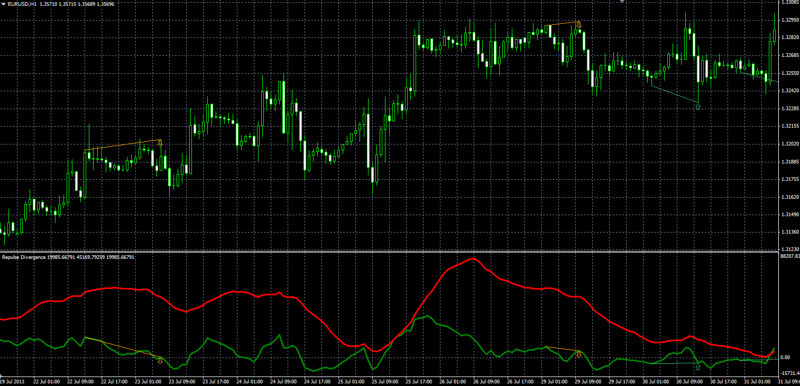

# Repulse divergence indicator

> Source: https://fxcodebase.com/code/viewtopic.php?f=38&t=60015  
> Forum: 38 · Topic 60015 · 1 post(s)

---

## Repulse divergence indicator

**Alexander.Gettinger** · Fri Nov 29, 2013 12:53 pm

The indicator search divergence between one of lines Repulse indicator ([viewtopic.php?f=38&t=60012&p=91205#p91205](https://fxcodebase.com/code/viewtopic.php?f=38&t=60012&p=91205#p91205)) and price.

 

Download:

 [Repulse_Divergence.mq4](files/91219/Repulse_Divergence.mq4)

For this indicators must be installed Repulse oscillator ([viewtopic.php?f=38&t=60012&p=91205#p91205](https://fxcodebase.com/code/viewtopic.php?f=38&t=60012&p=91205#p91205)).
