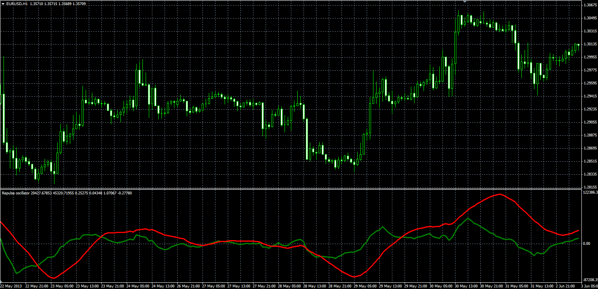

# Repulse oscillator

> Source: https://fxcodebase.com/code/viewtopic.php?f=38&t=60012  
> Forum: 38 · Topic 60012 · 2 post(s)

---

## Repulse oscillator

**Alexander.Gettinger** · Thu Nov 28, 2013 11:06 am

Formulas:
Repulse1[i] = Pos_EMA1[i]-Neg_EMA1[i],
Repulse2[i] = Pos_EMA2[i]-Neg_EMA2[i], where
Pos_EMA1, Neg_EMA1 - EMA(PosSt1), EMA(NegSt1) with (5*Length1) period,
Pos_EMA2, Neg_EMA2 - EMA(PosSt2), EMA(NegSt2) with (5*Length2) period,
PosSt1[i] = 100*(3*Close[i]-2*MinPrice1-Open[i])/Close[i],
NegSt1[i] = 100*(Open[i]+2*MaxPrice1-3*Close[i])/Close[i],
PosSt2[i] = 100*(3*Close[i]-2*MinPrice2-Open[i-Length2])/Close[i],
NegSt2[i] = 100*(Open[i-Length2]+2*MaxPrice2-3*Close[i])/Close[i],
MinPrice1, MaxPrice1 - minimum and maximum prices at range (i-Length1+1) to i,
MinPrice2, MaxPrice2 - minimum and maximum prices at range (i-Length2+1) to i.

 

Download:

 [Repulse.mq4](files/91205/Repulse.mq4)

---

## Re: Repulse oscillator

**Alexander.Gettinger** · Fri Nov 29, 2013 12:55 pm

Repulse divergence indicator: [viewtopic.php?f=38&t=60015](https://fxcodebase.com/code/viewtopic.php?f=38&t=60015)
