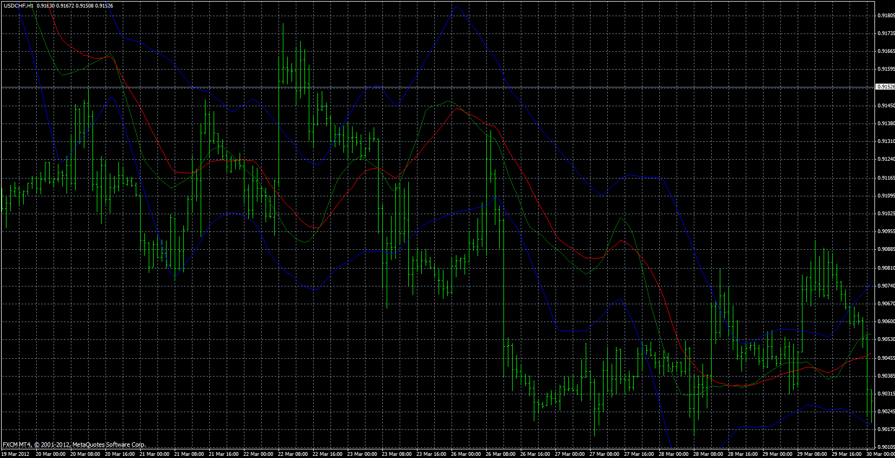
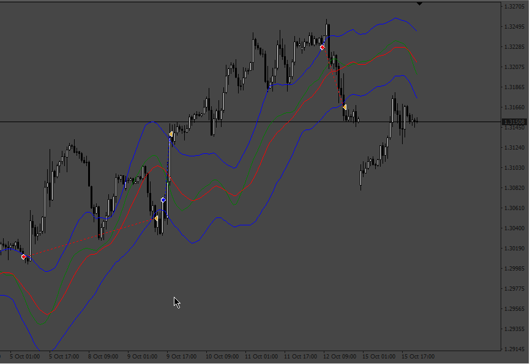

# Resistance/Support dinamyc lines

> Source: https://fxcodebase.com/code/viewtopic.php?f=38&t=23440  
> Forum: 38 · Topic 23440 · 4 post(s)

---

## Resistance/Support dinamyc lines

**Apprentice** · Sat Sep 15, 2012 1:37 pm

 [RSL.mq4](files/40351/RSL.mq4)

 

 [RSL EA.mq4](files/40351/RSL%20EA.mq4)

---

## Re: Resistance/Support dinamyc lines

**Apprentice** · Tue Dec 11, 2012 11:22 am

Updated

---

## Re: Resistance/Support dinamyc lines

**Alh Doh** · Tue Apr 30, 2013 6:27 am

Hello,

This indicator don't work on my mt4, the cause is : counted_bars - variable not defined

Thanks a lot.

---

## Re: Resistance/Support dinamyc lines

**Apprentice** · Tue Mar 22, 2022 11:01 am

RSL EA.mq4 added.
