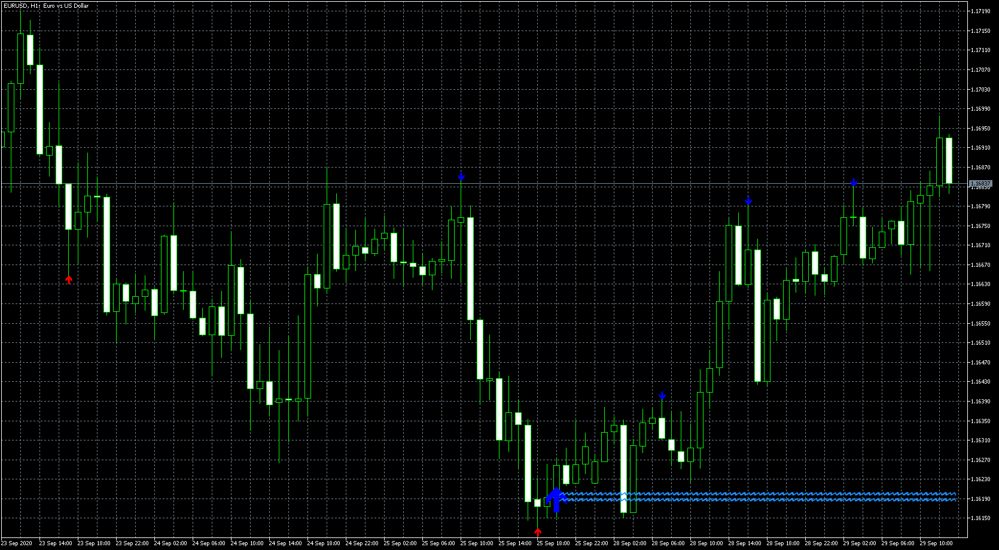

# Reverse No Repair &#Chaos ArrZZx2

> Source: https://fxcodebase.com/code/viewtopic.php?f=38&t=70498  
> Forum: 38 · Topic 70498 · 4 post(s)

---

## Reverse No Repair &#Chaos ArrZZx2

**Apprentice** · Tue Sep 29, 2020 5:43 am

Based on request.
[viewtopic.php?f=27&t=70492](https://fxcodebase.com/code/viewtopic.php?f=27&t=70492)

 [Reverse No Repair.mq5](files/137988/Reverse%20No%20Repair.mq5)

 [#Chaos ArrZZx2.mq5](files/137988/Chaos%20ArrZZx2.mq5)

 [Reverse_No_Repair.mq4](files/137988/Reverse_No_Repair.mq4)

---

## Re: Reverse No Repair &#Chaos ArrZZx2

**richard85** · Sun Aug 22, 2021 6:59 am

> **Apprentice wrote:**
>
>
> eurusd-h1-metaquotes-software-corp.png
>
>
> Based on request.
> [viewtopic.php?f=27&t=70492](https://fxcodebase.com/code/viewtopic.php?f=27&t=70492)
>
>
> Reverse No Repair.mq5
>
>
>
>
> #Chaos ArrZZx2.mq5

hi!
can you please convert the "reverse no repair" indicator to mt4?

---

## Re: Reverse No Repair &#Chaos ArrZZx2

**Apprentice** · Mon Aug 23, 2021 3:20 am

Your request is added to the development list.
Development reference 770.

---

## Re: Reverse No Repair &#Chaos ArrZZx2

**Apprentice** · Wed Aug 25, 2021 1:18 pm

Reverse_No_Repair.mq4 Added.
