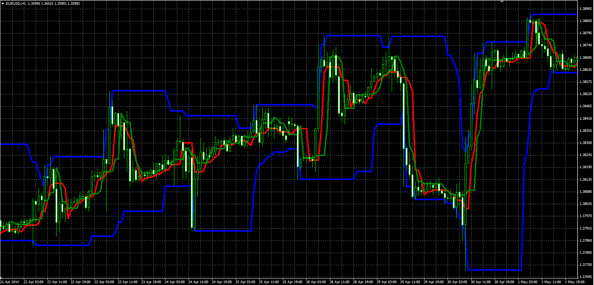

# ReverseMinMax indicator

> Source: https://fxcodebase.com/code/viewtopic.php?f=38&t=60762  
> Forum: 38 · Topic 60762 · 1 post(s)

---

## ReverseMinMax indicator

**Alexander.Gettinger** · Mon Jun 02, 2014 5:06 pm

Original LUA indicator: [viewtopic.php?f=17&t=60385](https://fxcodebase.com/code/viewtopic.php?f=17&t=60385).

Formulas:
ReverseMin[i] = Low[HL],
ReverseMax[i] = High[LH],
Min[i] = Low[LL],
Max[i] = High[HH], where
HL - index of highest Low price at range from (i-Reverse_Length+1) to (i-1),
LH - index of lowest High price at range from (i-Reverse_Length+1) to (i-1),
HH - index of highest High price at range from (i-Length+1) to (i-1),
LL - index of lowest Low price at range from (i-Length+1) to (i-1).

 

Download:

 [ReverseMinMax.mq4](files/94281/ReverseMinMax.mq4)
