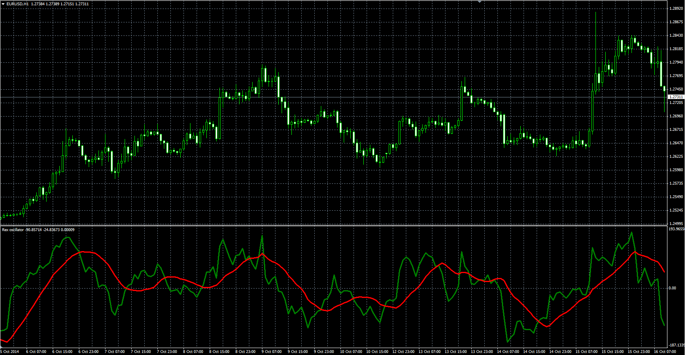

# Rex oscillator

> Source: https://fxcodebase.com/code/viewtopic.php?f=38&t=61373  
> Forum: 38 · Topic 61373 · 1 post(s)

---

## Rex oscillator

**Alexander.Gettinger** · Thu Oct 23, 2014 10:08 am

Original LUA oscillator: [viewtopic.php?f=17&t=24005](https://fxcodebase.com/code/viewtopic.php?f=17&t=24005).

Formulas:
Rex = MA(TVB) with [Smoothing_Length] number of periods and [Smoothing_Method] type,
Signal = MA(Rex) with [Signal_Length] number of periods and [Signal_Method] type, where
TVB = 3*Close-(Low+Open+High).

 

Download:

 [Rex.mq4](files/96711/Rex.mq4)

 [Rex with Alert.mq4](files/96711/Rex%20with%20Alert.mq4)
