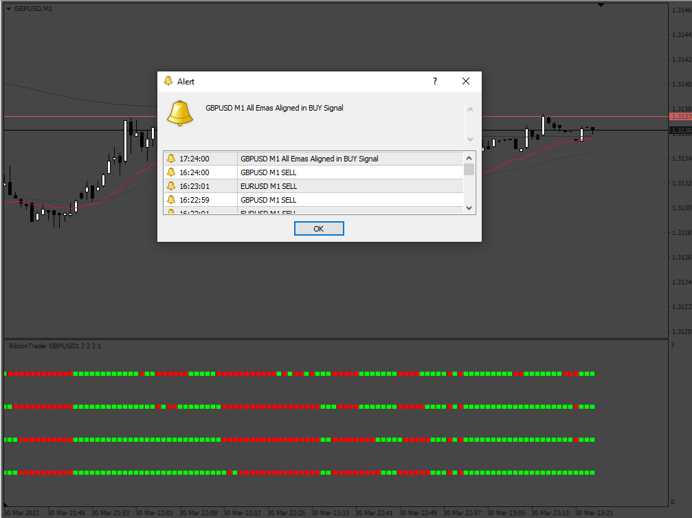

# ribbon-trader

> Source: https://fxcodebase.com/code/viewtopic.php?f=38&t=72027  
> Forum: 38 · Topic 72027 · 5 post(s)

---

## ribbon-trader

**Apprentice** · Fri Apr 01, 2022 2:04 am

Based on the request.
[https://fxcodebase.com/code/viewtopic.php?f=38&t=71997](https://fxcodebase.com/code/viewtopic.php?f=38&t=71997)

 [ribbon-trader.mq4](files/145502/ribbon-trader.mq4)

---

## Re: ribbon-trader

**Honest_Trader** · Mon Apr 04, 2022 1:34 am

Thank you Apprentice. Will check and revert.

God bless.

~ GK

---

## Re: ribbon-trader

**yutredo** · Wed Jun 01, 2022 10:26 am

hi;

Is it possible to make 2 edit in this indicaor you made.first can you put arrow when all emas aligned.
second can you please put buffer to (when all emas aligned) to make ea with universal ea.

thanks.

---

## Re: ribbon-trader

**Apprentice** · Fri Jun 03, 2022 4:32 am

We have added your request to the development list.
Development reference 324.

---

## Re: ribbon-trader

**Apprentice** · Mon Jun 13, 2022 5:32 am

[ribbon-trader.mq4](files/146355/ribbon-trader.mq4)

Try this version.
