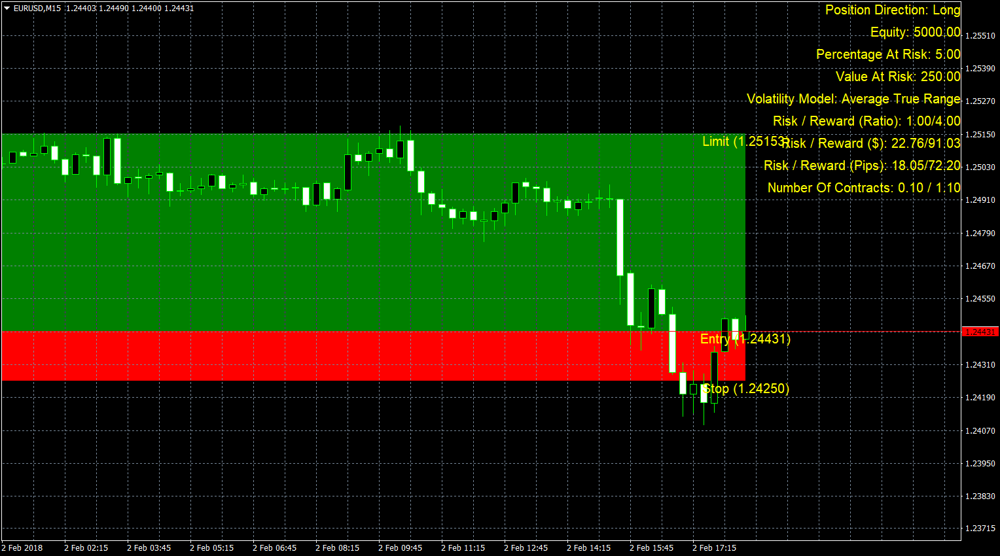

# Risk To Reward

> Source: https://fxcodebase.com/code/viewtopic.php?f=38&t=65690  
> Forum: 38 · Topic 65690 · 1 post(s)

---

## Risk To Reward

**Apprentice** · Fri Feb 02, 2018 1:39 pm

Lua/TS2 original.
[viewtopic.php?f=17&t=689](https://fxcodebase.com/code/viewtopic.php?f=17&t=689)

Risk To Reward Ratio
Helper for defining these, Entry Orders Stop Levels.

It enables you to the definition, risk to reward ratio, number of contract,
Entry level (manual or automatic), automatic or manual definition of capital that you are willing to risk (Pip or $) ...

Position Sizing
Tool has two modes. Volatility and Risk.
If you use a volatility mod, increased volatility, ATR, move away, Stop Entry level.
Risk mod - you define the distance for stop orders manualy.

 [Risk To Reward.ex4](files/117410/Risk%20To%20Reward.ex4)
