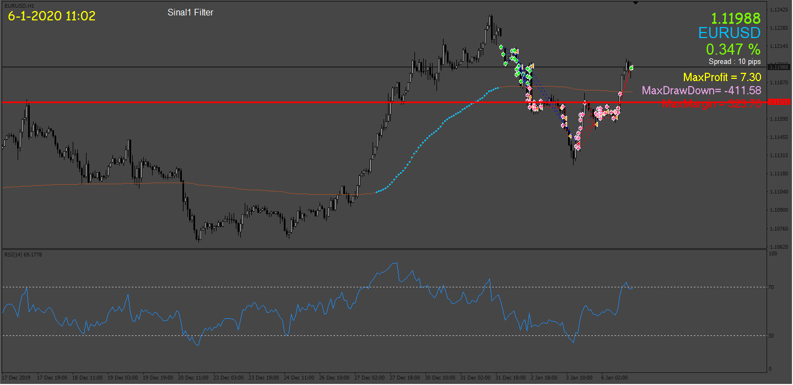

# ROBODOZ3R

> Source: https://fxcodebase.com/code/viewtopic.php?f=38&t=73575  
> Forum: 38 · Topic 73575 · 6 post(s)

---

## ROBODOZ3R

**Apprentice** · Fri Apr 07, 2023 2:06 pm

Based on the request.
[https://fxcodebase.com/code/viewtopic.php?f=27&p=150275](https://fxcodebase.com/code/viewtopic.php?f=27&p=150275)

 [Kaufman.mq4](files/150325/Kaufman.mq4)

 [ROBODOZ3R.mq4](files/150325/ROBODOZ3R.mq4)

---

## Re: ROBODOZ3R

**inver61** · Sat May 06, 2023 1:03 pm

Hello, thank you very much, it works perfectly. You could do the same in this other EA. That is to say, put the option "closeOnOpositeOn", the same. In other words, close when the purchase direction changes. Thank you very much for your help.

---

## Re: ROBODOZ3R

**Apprentice** · Sun May 07, 2023 4:32 am

We have added your request to the development list.
Development reference 403.

---

## Re: ROBODOZ3R

**inver61** · Mon Jun 05, 2023 4:16 am

Hello, I am attaching the indicator that you requested. thank you so much

---

## Re: ROBODOZ3R

**CValloggia** · Mon Jun 05, 2023 6:40 am

> **inver61 wrote:**
> Hello, thank you very much, it works perfectly. You could do the same in this other EA. That is to say, put the option "closeOnOpositeOn", the same. In other words, close when the purchase direction changes. Thank you very much for your help.

Hello, I'm making this task and I have a litle issue, I need the indicator **"SuperTrendTF.ex4"** to finish the task, **can you please provide this indicator**?
thanks in advance

---

## Re: ROBODOZ3R

**Apprentice** · Mon Jun 12, 2023 3:01 pm

Try this version.
[https://fxcodebase.com/code/viewtopic.php?f=38&t=73819](https://fxcodebase.com/code/viewtopic.php?f=38&t=73819)
