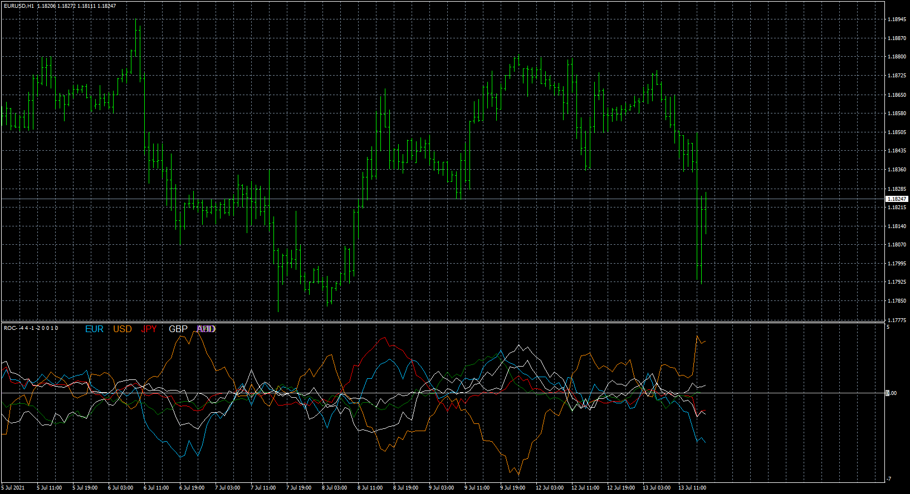
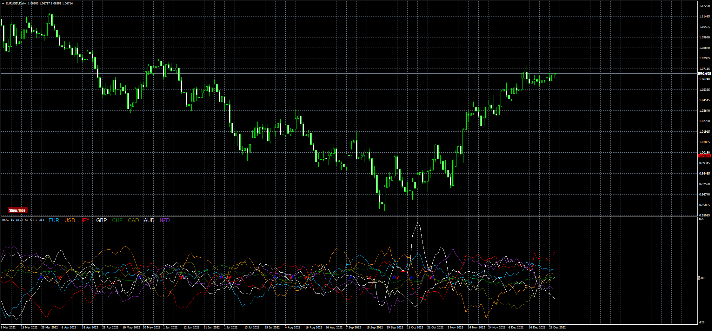

# roc-multi-currency-indicator

> Source: https://fxcodebase.com/code/viewtopic.php?f=38&t=71408  
> Forum: 38 · Topic 71408 · 6 post(s)

---

## roc-multi-currency-indicator

**Apprentice** · Mon Aug 09, 2021 2:21 pm

Based on the request.
[https://fxcodebase.com/code/viewtopic.php?f=17&t=71404](https://fxcodebase.com/code/viewtopic.php?f=17&t=71404)

 [roc-multi-currency-indicator.mq4](files/143159/roc-multi-currency-indicator.mq4)

TS2 version.
[https://fxcodebase.com/code/viewtopic.php?f=17&t=71411](https://fxcodebase.com/code/viewtopic.php?f=17&t=71411)

---

## Re: roc-multi-currency-indicator

**Apprentice** · Thu Aug 12, 2021 7:38 am

[roc-multi-currency-indicator.mq4](files/143201/roc-multi-currency-indicator.mq4)

Cross Option Added.
Chart Instrument Option Added.
Instrument Selector Option Added.

---

## Re: roc-multi-currency-indicator

**naluvs01** · Wed Dec 21, 2022 2:41 pm

I have a simple request. if possible, can an alert option be added when the currencies cross each other, disregarding the 0 level. Currently the alerts happen only when the 0 level is crossed and it would be great to have an option to turn off the 0 level, as well as have the message read which Currency crossed instead of the pair. For instance, if USD crossed JPY down, it reads USDJPY down, instead of USD crossed JPY down. But this is not a huge issue. However, disregarding the 0 level is more important.

I would greatly appreciate it!

Thank you in advance for you time and consideration!!!!!!!!

---

## Re: roc-multi-currency-indicator

**Apprentice** · Thu Dec 22, 2022 9:30 am

We have added your request to the development list.
Development reference 845.

---

## Re: roc-multi-currency-indicator

**Apprentice** · Fri Dec 30, 2022 3:49 am

Try this version.

 [roc-multi-currency-indicator.mq4](files/148836/roc-multi-currency-indicator.mq4)

---

## Re: roc-multi-currency-indicator

**naluvs01** · Wed Jan 04, 2023 2:39 am

Thank you!
