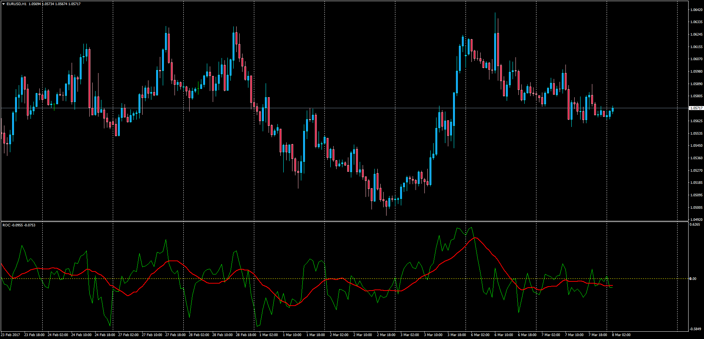

# ROC with MA Signal

> Source: https://fxcodebase.com/code/viewtopic.php?f=38&t=64509  
> Forum: 38 · Topic 64509 · 1 post(s)

---

## ROC with MA Signal

**Apprentice** · Wed Mar 08, 2017 1:25 pm

Description:
Some analysis require the ROC and also if that value is over or under its MA signal as well as the zero level.

 [ROC_with_Signal_MA.mq4](files/111367/ROC_with_Signal_MA.mq4)
