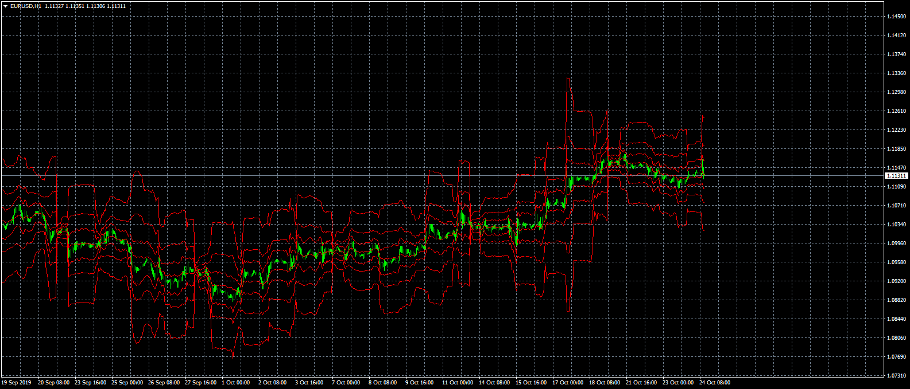

# Rolling_Pivots_Indicator

> Source: https://fxcodebase.com/code/viewtopic.php?f=38&t=69049  
> Forum: 38 · Topic 69049 · 2 post(s)

---

## Rolling_Pivots_Indicator

**Apprentice** · Thu Oct 24, 2019 6:07 am

TS2/Lua version.
[viewtopic.php?f=17&t=69040](https://fxcodebase.com/code/viewtopic.php?f=17&t=69040)

 [Rolling_Pivots_Indicator.mq4](files/129400/Rolling_Pivots_Indicator.mq4)

---

## Re: Rolling_Pivots_Indicator

**paulcarissimo** · Thu Oct 24, 2019 5:46 pm

> **Apprentice wrote:**
>
>
> eurusd-h1-forex-capital-markets.png
>
>
> TS2/Lua version.
> [viewtopic.php?f=17&t=69040](https://fxcodebase.com/code/viewtopic.php?f=17&t=69040)
>
>
> Rolling_Pivots_Indicator.mq4

Thank you very much Apprentice.
