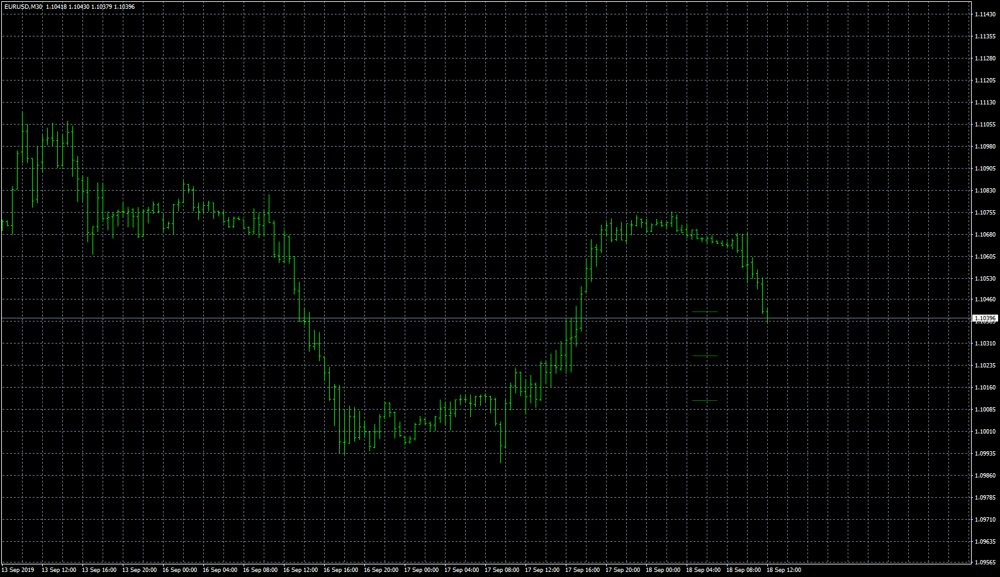

# RoomUpDown

> Source: https://fxcodebase.com/code/viewtopic.php?f=38&t=68972  
> Forum: 38 · Topic 68972 · 5 post(s)

---

## RoomUpDown

**Apprentice** · Wed Oct 02, 2019 4:25 am

Based on request.
[viewtopic.php?f=27&t=67216](https://fxcodebase.com/code/viewtopic.php?f=27&t=67216)

 [RoomUpDown.mq4](files/128941/RoomUpDown.mq4)

---

## Re: RoomUpDown

**logicgate** · Wed Oct 02, 2019 7:10 am

Thanks buddy, but you remove a important part of the code: when we hover the mouse over the plotted lines, a little window should show the ATR value and the percentage.

Also, the vertical line is not plotting correctly. I set the ADR do daily timeframe, so the vertical line should plot at the start of the day 00:00, and now it is plotting 30 days ago. If I set the ADR to weekly, it should plot at the start of the weekly bar, and to monthly, at the start of the monthly bar.

Here a screenshot attached of the original version, plotting the vertical line correctly at the start of the day, and showing the values of the lines:

---

## Re: RoomUpDown

**Apprentice** · Thu Oct 03, 2019 4:58 am

Your request is added to the development list.
Development reference 157.

---

## Re: RoomUpDown

**Apprentice** · Wed Oct 16, 2019 8:46 am

[RoomUpDown.mq4](files/129250/RoomUpDown.mq4)

Try this version.

---

## Re: RoomUpDown

**logicgate** · Wed Oct 16, 2019 11:05 am

Thanks mate, gonna test it now.
