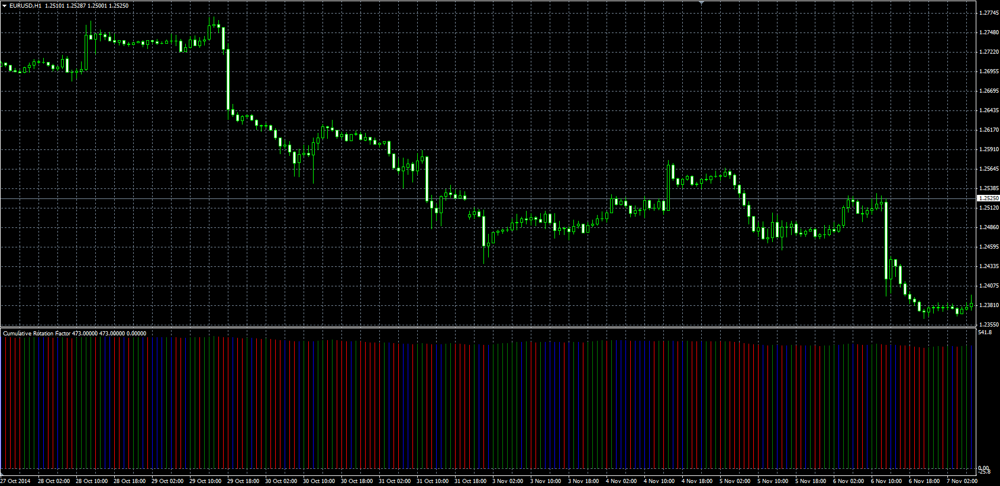

# Rotation Factor

> Source: https://fxcodebase.com/code/viewtopic.php?f=38&t=61466  
> Forum: 38 · Topic 61466 · 8 post(s)

---

## Rotation Factor

**Alexander.Gettinger** · Tue Nov 18, 2014 11:47 am

Original LUA oscillator: [viewtopic.php?f=17&t=20592](https://fxcodebase.com/code/viewtopic.php?f=17&t=20592).

 

Download:

 [CRF.mq4](files/97158/CRF.mq4)

---

## Re: Rotation Factor

**logicgate** · Fri Jan 11, 2019 9:07 am

Hello dear friend, hope all is good.

Can you compile a new MT4 version of Rotation Factor based on the code below? thanks!

_SECTION_BEGIN("Rotation Factor - Market Profile");

RF = 0;
NewDay = day() != Ref(day(), -1);

for(i=1;i<BarCount;i++)
{
if(NewDay[i]==True)
{
BarsUp[i]=0;
BarsDown[i]=0;
RF[i] = 0;

}
//If Current Bar Makes HH and HL
if(H[i]>H[i-1] AND L[i]>L[i-1] AND !NewDay[i])
{
RF[i]=RF[i-1]+2;
}

//If Current Bar Makes LH and LL
if(H[i]<H[i-1] AND L[i]<L[i-1] AND !NewDay[i])
{
RF[i]=RF[i-1]-2;
}

//If Current Bar Makes HH and LL
if(H[i]>H[i-1] AND L[i]<L[i-1] AND !NewDay[i])
{
RF[i]=RF[i-1];
}

//If Current Bar Makes LH and HL
if(H[i]<H[i-1] AND L[i]>L[i-1] AND !NewDay[i])
{
RF[i]=RF[i-1];
}

if(H[i]==H[i-1] AND L[i]>L[i-1] AND !NewDay[i])
{
RF[i]=RF[i-1]+1;
}

if(H[i]>H[i-1] AND L[i]==L[i-1] AND !NewDay[i])
{
RF[i]=RF[i-1]+1;
}

if(H[i]<H[i-1] AND L[i]==L[i-1] AND !NewDay[i])
{
RF[i]=RF[i-1]-1;
}

if(H[i]==H[i-1] AND L[i]<L[i-1] AND !NewDay[i])
{
RF[i]=RF[i-1]-1;
}

}

Plot(0,"",colorred,styleline);
Plot(RF,"Rotational Factor", IIf(RF>0,colorGreen,colorRed),styleHistogram | stylethick);

_SECTION_END();

---

## Re: Rotation Factor

**Apprentice** · Sun Jan 13, 2019 7:56 am

Your request is added to the development list under Id Number 4422

---

## Re: Rotation Factor

**Alexander.Gettinger** · Tue Jan 15, 2019 4:25 pm

Please try this indicator:

 [CRF2.mq4](files/123373/CRF2.mq4)

---

## Re: Rotation Factor

**logicgate** · Wed Jan 16, 2019 6:02 pm

> **Alexander.Gettinger wrote:**
> Please try this indicator:
>
>
> CRF2.mq4

Thanks brother!

---

## Re: Rotation Factor

**logicgate** · Mon Oct 07, 2019 3:12 pm

My friend, can you please make this indicator to show only a label with the value so we can drag and drop anywhere on chart?

Label like **RF: 8** for example

Also, the indicator should reset calculation at 00:00 (the start of a new daily bar) otherwise it is always accumulating.

It would be interesting if we had the option to choose the start time of the reset, for example, if I might be interested in seeing the rotation factor to start calculating at 08:00 (NY forex session open)

Cheers

---

## Re: Rotation Factor

**Apprentice** · Wed Oct 09, 2019 11:04 am

Your request is added to the development list.
Development reference 164.

---

## Re: Rotation Factor

**Apprentice** · Thu Oct 10, 2019 1:00 pm

Try this version.

 [CRF2_label.mq4](files/129128/CRF2_label.mq4)
