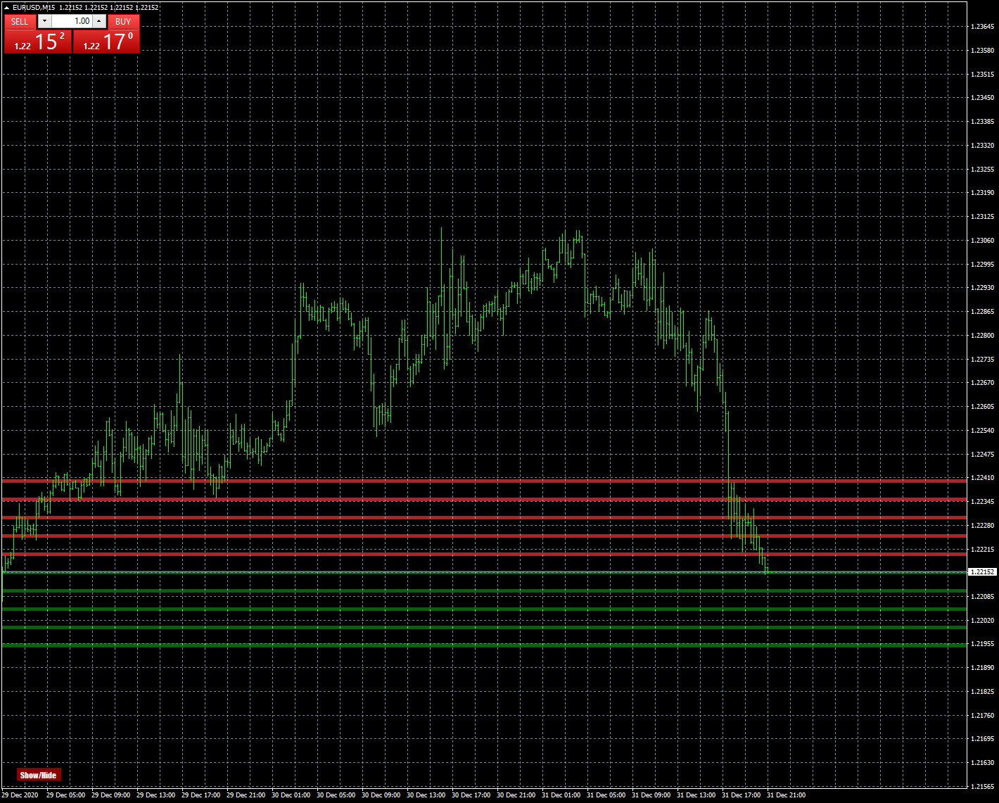

# RoundLevels

> Source: https://fxcodebase.com/code/viewtopic.php?f=38&t=70774  
> Forum: 38 · Topic 70774 · 9 post(s)

---

## RoundLevels

**Apprentice** · Sun Jan 03, 2021 6:20 am

Based on request.
[viewtopic.php?f=27&t=70765](https://fxcodebase.com/code/viewtopic.php?f=27&t=70765)

 [RoundLevels.mq4](files/139948/RoundLevels.mq4)

---

## Re: RoundLevels

**zero999** · Mon Jan 04, 2021 1:36 am

Thanks a lot
 How can I change the position of this button on the chart?

---

## Re: RoundLevels

**zero999** · Mon Jan 04, 2021 1:42 am

I forgot to say that please allow me to add a unique ID for the indicator so that I can add the indicator more than once.

---

## Re: RoundLevels

**Apprentice** · Mon Jan 04, 2021 4:20 am

Your request is added to the development list.
Development reference 23.

---

## Re: RoundLevels

**Apprentice** · Tue Jan 05, 2021 9:01 am

Try this version.

 [RoundLevels.mq4](files/140016/RoundLevels.mq4)

---

## Re: RoundLevels

**zero999** · Tue Jan 05, 2021 10:25 am

It is excellent
This indicator has a bug, fix it if possible
At maximum zoom out, the lines disappear from the chart

---

## Re: RoundLevels

**im09p08** · Wed Jan 06, 2021 2:46 am

Hi
Dear friend, can you do the same thing on this indicator?

---

## Re: RoundLevels

**Apprentice** · Wed Jan 06, 2021 11:35 am

Your request is added to the development list.
Development reference 38.

---

## Re: RoundLevels

**Apprentice** · Thu Jan 07, 2021 8:33 am

I don't have any issues. Take a look at the Experts tab after the lines disappear. There should be an error message and the line number where the error happened.
