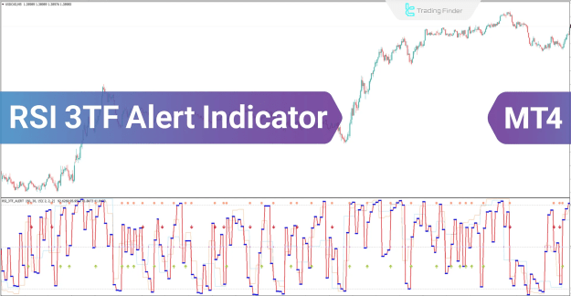

# RSI 3TF Alert Indicator for MetaTrader 4 [Download Free]

> Source: https://fxcodebase.com/code/viewtopic.php?f=38&t=75660  
> Forum: 38 · Topic 75660 · 1 post(s)

---

## RSI 3TF Alert Indicator for MetaTrader 4 [Download Free]

**tradingfinder** · Sat Mar 01, 2025 3:29 am

**RSI 3TF Alert Indicator for MT4: Multi-Timeframe RSI Made Simple**

The RSI 3TF Alert (RSI 3TFA) indicator combines three RSI oscillators into one chart, simplifying multi-timeframe analysis and providing clear buy/sell signals. This makes it easier to spot trend continuations and reversals across different timeframes.

RSI 3TF Alert (RSI 3TFA) in MT4:
[https://tradingfinder.com/products/indi ... -dwonload/](https://tradingfinder.com/products/indicators/mt4/rsi-alert-free-dwonload/)

You can download from this link:
[https://cdn.tradingfinder.com/file/2479 ... b-v1-2.zip](https://cdn.tradingfinder.com/file/247919/rsi-3tf-alert-mt4-by-tflab-v1-2.zip)

YouTube Video Tutorial:
[https://youtu.be/OEbrKNr-v64](https://youtu.be/OEbrKNr-v64)

**How It Works:**

* **Buy Signal:** When all three RSI lines cross above the 50 level.
* **Sell Signal:** When all three RSI lines cross below the 50 level.
* **Visual Confirmation:** Blue dots (customizable) represent additional RSI values, with options to include up to six RSIs.

**Key Features:**

* **Multi-Timeframe Analysis:** Combines RSI data from three timeframes.
* **Clear Buy/Sell Signals:** Generates easy-to-understand alerts.
* **Customizable RSI Periods:** Adjust settings for each RSI.
* **Automatic MTF Selection:** Sets higher timeframes automatically when set to 0.
* **Visual Customization:** Adjust line and dot sizes.
* **Adjustable Bar History:** Define the number of bars analyzed.
* **Versatile Application:** Works with Forex, cryptocurrencies, and indices.
* **Suitable for Various Trading Styles:** Scalping, day trading, and intraday trading.

**Trading Examples:**

* **Buy Signal:** When the indicator shows all three RSI lines crossing above 50, indicating potential upward momentum.
* **Sell Signal:** When the indicator shows all three RSI lines crossing below 50, indicating potential downward momentum.

**Indicator Settings:**

* **RSI Periods:** Set the period for each of the three RSI oscillators.
* **Multi-Timeframe (MTF):** Configure timeframes or use automatic selection.
* **Line and Dot Sizes:** Adjust visual elements.
* **Number of Bars:** Set the historical data used for calculations.

**Why Use the RSI 3TF Alert Indicator?**

* **Simplified Multi-Timeframe Analysis:** Quickly see RSI trends across multiple timeframes.
* **Improved Signal Accuracy:** Multi-RSI confirmation reduces false signals.
* **Easy Trend Identification:** Spot trend continuations and reversals efficiently.
* **Customizable Settings:** Tailor the indicator to your trading style.

**Pro Tip:**

* Combine the RSI 3TFA with support and resistance levels for stronger trade confirmations.

**Key Improvements:**

* Clearer and more concise language.
* Emphasis on the benefits of multi-timeframe analysis.
* Simplified explanation of how signals are generated.
* Improved organization and readability.
* Removed redundant phrases.

 

 

 

 

 [rsi-3tf-alert-mt4-by-tflab-v1-2.zip](files/158450/rsi-3tf-alert-mt4-by-tflab-v1-2.zip)
