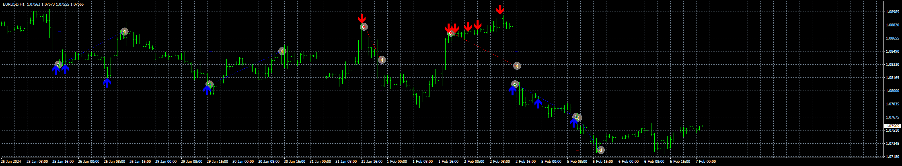

# RSI_Arrow_EA

> Source: https://fxcodebase.com/code/viewtopic.php?f=38&t=74594  
> Forum: 38 · Topic 74594 · 7 post(s)

---

## RSI_Arrow_EA

**Apprentice** · Tue Feb 06, 2024 7:31 pm

Based on the request.
[https://fxcodebase.com/code/viewtopic.php?f=17&t=74489](https://fxcodebase.com/code/viewtopic.php?f=17&t=74489)

 [RSI_arrow.mq4](files/154312/RSI_arrow.mq4)

 [RSI_Arrow_EA_v1.00.mq4](files/154312/RSI_Arrow_EA_v1.00.mq4)

 [RSI_Arrow.mq5](files/154312/RSI_Arrow.mq5)

 [RSI_Arrow_EA_v1.00.mq5](files/154312/RSI_Arrow_EA_v1.00.mq5)

---

## Re: RSI_Arrow_EA

**rgarcia** · Mon Mar 04, 2024 2:37 pm

good, work fine!
I think if you include a grid when the trade is going wrong we can improve the results, (just for mt4)

thanks in advance

---

## Re: RSI_Arrow_EA

**Apprentice** · Sat Mar 09, 2024 10:27 am

We have added your request to the development list.
Development reference 214

---

## Re: RSI_Arrow_EA

**Apprentice** · Wed Mar 20, 2024 2:42 pm

Grid option added.

 [RSI_Arrow_EA_v1.10.mq4](files/154752/RSI_Arrow_EA_v1.10.mq4)

---

## Re: RSI_Arrow_EA

**anangfx** · Sun Jun 09, 2024 3:17 am

could you add set martingle strategy when the single entry loss,
i see in this version , marti only on grid setup , if this can add marti for single entry, i really like it

thanks bro

---

## Re: RSI_Arrow_EA

**Apprentice** · Wed Jun 12, 2024 3:14 pm

We have added your request to the development list.
Development reference 489

---

## Re: RSI_Arrow_EA

**Apprentice** · Wed Jun 19, 2024 4:59 pm

[RSI_Arrow_EA_v1.20.mq4](files/155830/RSI_Arrow_EA_v1.20.mq4)

Try this version.
