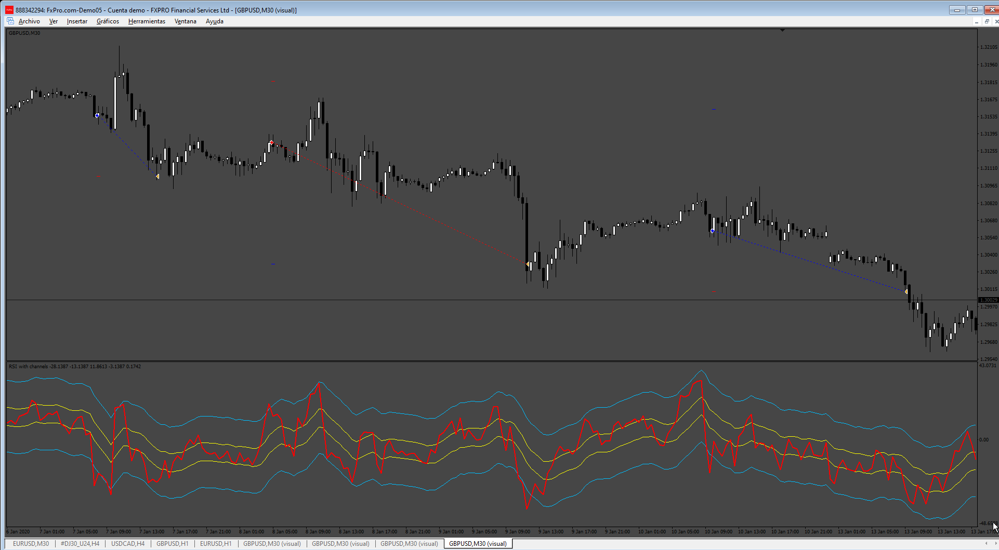

# RSI_Bands_EA

> Source: https://fxcodebase.com/code/viewtopic.php?f=38&t=75078  
> Forum: 38 · Topic 75078 · 5 post(s)

---

## RSI_Bands_EA

**Apprentice** · Sat Jul 20, 2024 8:03 am

Based on the request.
[https://fxcodebase.com/code/viewtopic.php?f=38&t=75052](https://fxcodebase.com/code/viewtopic.php?f=38&t=75052)

 [RSI with channels.mq4](files/156182/RSI%20with%20channels.mq4)

 [RSI_Bands_EA.mq4](files/156182/RSI_Bands_EA.mq4)

 [RSI_with_channels.mq5](files/156182/RSI_with_channels.mq5)

 [RSI_with_channels_EA_v1.00.mq5](files/156182/RSI_with_channels_EA_v1.00.mq5)

---

## Re: RSI_Bands_EA

**gomezM** · Sat Aug 24, 2024 6:29 am

Thanks work great!

---

## Re: RSI_Bands_EA

**VuxxLong** · Fri Sep 13, 2024 2:50 am

Could you please convert this for MT5?
Thanks

---

## Re: RSI_Bands_EA

**Apprentice** · Sat Sep 14, 2024 3:34 am

We have added your request to the development list.
Development reference 707

---

## Re: RSI_Bands_EA

**Apprentice** · Wed Sep 25, 2024 3:39 pm

MT5 version added.
