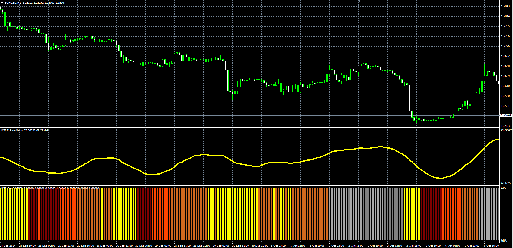

# RSI Bar

> Source: https://fxcodebase.com/code/viewtopic.php?f=38&t=61479  
> Forum: 38 · Topic 61479 · 1 post(s)

---

## RSI Bar

**Alexander.Gettinger** · Tue Nov 18, 2014 5:15 pm

Original LUA oscillator: [viewtopic.php?f=17&t=14385](https://fxcodebase.com/code/viewtopic.php?f=17&t=14385).

> The indicator changes color depending on whether we are above or below the central line,
> in the overbought / oversold area.
> We use smoothed data , if you use 1 as smoothing period, You'll have your regular RSI indicator, indication.

 

Download:

 [RSI_Bar.mq4](files/97186/RSI_Bar.mq4)
