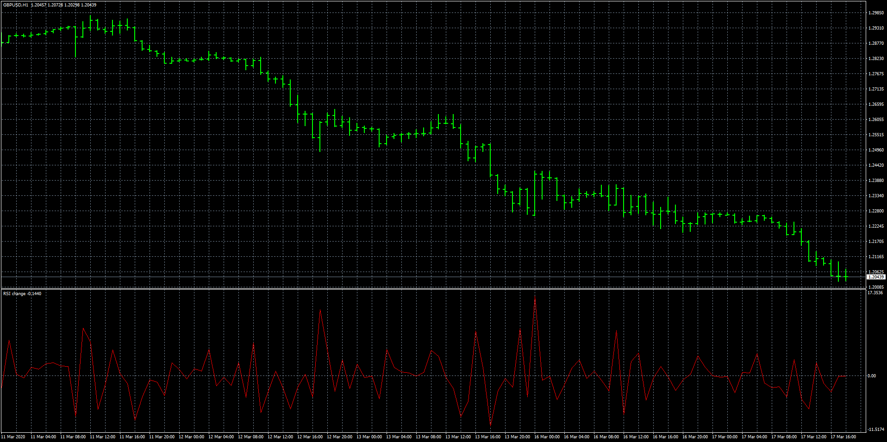

# RSI change

> Source: https://fxcodebase.com/code/viewtopic.php?f=38&t=70077  
> Forum: 38 · Topic 70077 · 4 post(s)

---

## RSI change

**Apprentice** · Thu Jun 25, 2020 6:20 am

TS2/Lua version.
[viewtopic.php?f=17&t=70038](https://fxcodebase.com/code/viewtopic.php?f=17&t=70038)

 [RSI change.mq4](files/135282/RSI%20change.mq4)

 [RSI change CS CTF.mq4](files/135282/RSI%20change%20CS%20CTF.mq4)

---

## Re: RSI change

**alienfriend18** · Thu Jun 25, 2020 12:44 pm

Please add multi symbol option

---

## Re: RSI change

**Apprentice** · Thu Jun 25, 2020 1:33 pm

Your request is added to the development list.
Development reference 1558.

---

## Re: RSI change

**Apprentice** · Fri Jun 26, 2020 3:55 am

RSI change CS CTF.mq4 added.
