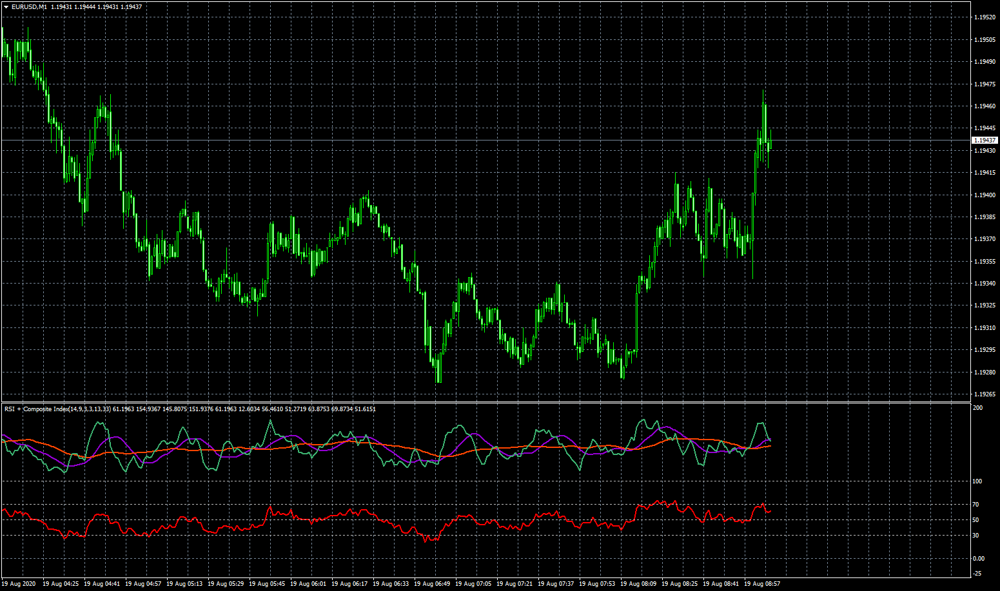

# RSI_+_Composite_Index

> Source: https://fxcodebase.com/code/viewtopic.php?f=38&t=70308  
> Forum: 38 · Topic 70308 · 4 post(s)

---

## RSI_+_Composite_Index

**Apprentice** · Wed Aug 19, 2020 2:57 am

TS2/Lua version.
[viewtopic.php?f=17&t=70302](https://fxcodebase.com/code/viewtopic.php?f=17&t=70302)

 [RSI_+_Composite_Index.mq4](files/136924/RSI__Composite_Index.mq4)

---

## Re: RSI_+_Composite_Index

**kwakugyau** · Thu Aug 20, 2020 5:44 pm

Please add the buy/sell arrows, with buffers.
Thank you.

---

## Re: RSI_+_Composite_Index

**Apprentice** · Fri Aug 21, 2020 5:40 am

Your request is added to the development list.
Development reference 1915.

---

## Re: RSI_+_Composite_Index

**Apprentice** · Tue Sep 08, 2020 3:43 am

I need rules for the arrows.
