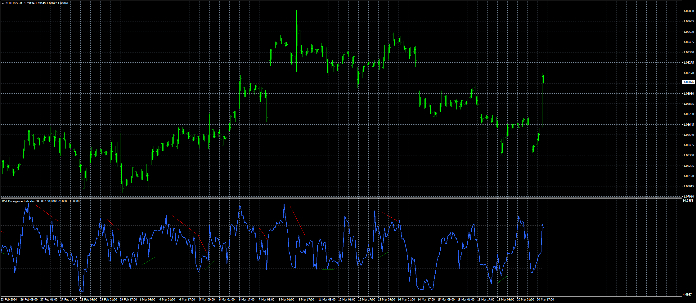
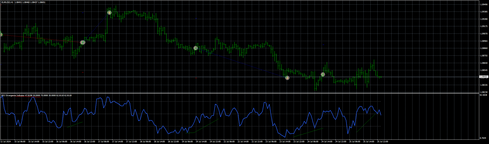

# RSI_Divergence_Indicator

> Source: https://fxcodebase.com/code/viewtopic.php?f=38&t=74713  
> Forum: 38 · Topic 74713 · 5 post(s)

---

## RSI_Divergence_Indicator

**Apprentice** · Wed Mar 20, 2024 2:04 pm

Based on the request.
[https://fxcodebase.com/code/viewtopic.php?f=17&t=74669](https://fxcodebase.com/code/viewtopic.php?f=17&t=74669)

 [RSI_Divergence_Indicator.mq4](files/154742/RSI_Divergence_Indicator.mq4)

 [RSI_Divergence_Indicator.mq5](files/154742/RSI_Divergence_Indicator.mq5)

---

## Re: RSI_Divergence_Indicator

**Apprentice** · Sun Sep 08, 2024 3:33 pm

MT5 version added.

---

## Re: RSI_Divergence_Indicator

**trtrader** · Sun Sep 08, 2024 3:49 pm

Could you please built an EA based on this? Buy sell and close by opposite.

TP, SL, BE and trailing stop as well.

Thanks

---

## Re: RSI_Divergence_Indicator

**Apprentice** · Sat Sep 14, 2024 4:01 am

We have added your request to the development list.
Development reference 723

---

## Re: RSI_Divergence_Indicator

**Apprentice** · Wed Sep 25, 2024 3:27 pm

 [RSI_Divergence_Indicator.mq4](files/156789/RSI_Divergence_Indicator.mq4)

 [RSI_Divergence_Indicator_EA_v1.00.mq4](files/156789/RSI_Divergence_Indicator_EA_v1.00.mq4)
