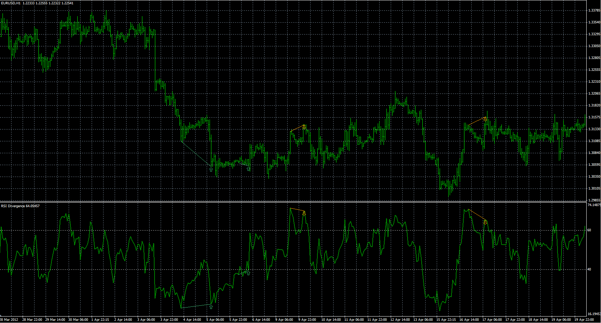

# RSI divergence indicator

> Source: https://fxcodebase.com/code/viewtopic.php?f=38&t=21033  
> Forum: 38 · Topic 21033 · 12 post(s)

---

## RSI divergence indicator

**Alexander.Gettinger** · Fri Jul 13, 2012 9:26 am

The indicator shows RSI, RSI divergence lines and trend lines on the prices.

 

Download:

 [RSI_Divergence.mq4](files/36860/RSI_Divergence.mq4)

---

## Re: RSI divergence indicator

**speedytina** · Thu Feb 28, 2013 1:12 pm

Hello Alexander:

Great mt4 indicator. Does it include visual or sound alert when divergence is formed?

Also, is there an "EA" for this or is one in development?

Much appreciate you feedback.

Thanks,
 speedytina

---

## Re: RSI divergence indicator

**Apprentice** · Fri Mar 01, 2013 5:07 am

Unfortunately not,
I added your request on development list.

---

## Re: RSI divergence indicator

**speedytina** · Sat Mar 02, 2013 6:41 am

Thank you Apprentice.

---

## Re: RSI divergence indicator

**tayjuichuan** · Fri May 09, 2014 5:39 am

Hi
how do i download and instal the rsi divergence indicator into my mt4 platform?
Tks

---

## Re: RSI divergence indicator

**Apprentice** · Sat May 10, 2014 2:17 am

Using Meta Editor
1. Download the Indicator.
2. Close MT4 Platform
3. Open it with Meta Editor
4. Here you can try to compile the code in the subject.
This is to check if the code in the subject is compatible with the new build of MT4 (optional)
5. Save the indicator to Indicator Folder.
6. Open the MT4

1. Download the Indicator.
2. Close MT4 Platform
3. Save the indicator to Indicator Folder.
In my case this is...

Code: [Select all](https://fxcodebase.com/code/)
`C:\Users\Apprentice\AppData\Roaming\MetaQuotes\Terminal\BB190E062770E27C3E79391AB0D1A117\MQL4\Indicators`
4. Open the MT4

---

## Re: RSI divergence indicator

**paololuigi** · Tue Oct 06, 2015 10:39 am

Sorry is possible to have a divergence indicator for ADX

---

## Re: RSI divergence indicator

**Apprentice** · Thu Oct 08, 2015 5:04 am

Your request is added to the development list.

---

## Re: RSI divergence indicator

**james442** · Fri Feb 12, 2016 2:45 am

Hello Alexander:

Great mt4 indicator. Does it include visual or sound alert when divergence is formed?

---

## Re: RSI divergence indicator

**Apprentice** · Thu Feb 25, 2016 11:35 am

As it is NO.

---

## Re: RSI divergence indicator

**Alexander.Gettinger** · Wed Dec 12, 2018 9:39 pm

> **paololuigi wrote:**
> Sorry is possible to have a divergence indicator for ADX

Please try this indicator:

 [ADX_Divergence.mq4](files/122755/ADX_Divergence.mq4)

---

## Re: RSI divergence indicator

**Alexander.Gettinger** · Tue Dec 18, 2018 6:54 pm

> **speedytina wrote:**
> Great mt4 indicator. Does it include visual or sound alert when divergence is formed?

Please try this version of the indicator:

 [RSI_Divergence.mq4](files/122933/RSI_Divergence.mq4)
