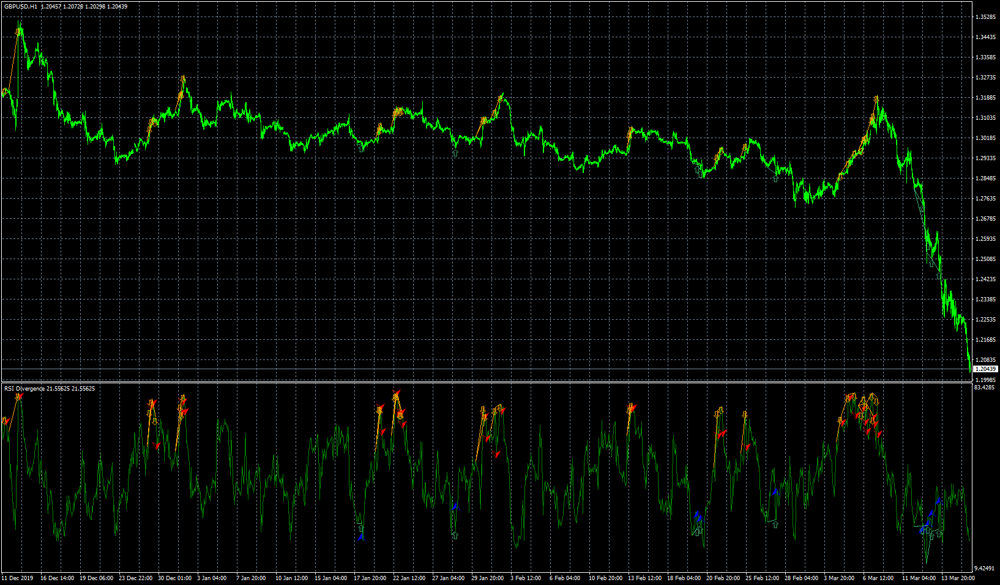

# RSI Divergence

> Source: https://fxcodebase.com/code/viewtopic.php?f=38&t=70094  
> Forum: 38 · Topic 70094 · 28 post(s)

---

## RSI Divergence

**Apprentice** · Mon Jun 29, 2020 8:31 am

Based on request.
[viewtopic.php?f=27&t=70078](https://fxcodebase.com/code/viewtopic.php?f=27&t=70078)

 [RSI Divergence.mq4](files/135407/RSI%20Divergence.mq4)

---

## Re: RSI Divergence

**SEMJUNIOR** · Fri Jul 03, 2020 2:07 am

> **Apprentice wrote:**
>
>
> gbpusd-h1-fxcm-australia-pty-2.png
>
>
> Based on request.
> [viewtopic.php?f=27&t=70078](https://fxcodebase.com/code/viewtopic.php?f=27&t=70078)
>
>
> RSI Divergence.mq4

Exceptional work. Big thanks to you.
I also noticed that there is an omission of this "else if (RSI [curr]> RSI [prev] && High [curr] <High [prev])"
on line 1151.
This had affected (BEARISH CONDITION). I have already corrected my level and it works wonderfully. You have to complete this and update.

excellent work.
thank thank

---

## Re: RSI Divergence

**Apprentice** · Fri Jul 03, 2020 4:23 am

Can you post, fixed version?

---

## Re: RSI Divergence

**SEMJUNIOR** · Fri Jul 03, 2020 11:40 am

> **Apprentice wrote:**
> Can you post, fixed version?

---

## Re: RSI Divergence

**graphite** · Fri Aug 07, 2020 3:35 am

Hi Apprentice,

I have attached an RSI indicator. Now it's giving alerts when new low/high makes.
Can you please add alerts (popup & push notification) for the following conditions?

Alert Conditions:
If RSI breaks & closed above the Deepskyblu line, need buy alert.
If RSI breaks & closed below the Red line, need sell alert.

Thanks in advance.

---

## Re: RSI Divergence

**Apprentice** · Fri Aug 07, 2020 4:35 am

Your request is added to the development list.
Development reference 1849.

---

## Re: RSI Divergence

**graphite** · Thu Aug 13, 2020 4:30 am

> **Apprentice wrote:**
> Your request is added to the development list.
> Development reference 1849.

Hi Apprentice,
Can you please consider my above request regarding alerts?

---

## Re: RSI Divergence

**Apprentice** · Thu Aug 13, 2020 5:57 am

We have not forgotten your request,
unfortunately, we will have a limited output in the next few weeks,
due to the vacation season.

---

## Re: RSI Divergence

**graphite** · Thu Aug 13, 2020 7:51 am

Thank you sir.

---

## Re: RSI Divergence

**graphite** · Sun Sep 06, 2020 10:59 pm

> **Apprentice wrote:**
> We have not forgotten your request,
> unfortunately, we will have a limited output in the next few weeks,
> due to the vacation season.

Can you please look on my request? I was waiting for this since last 1 month.

---

## Re: RSI Divergence

**spidernet57** · Mon Sep 07, 2020 7:33 am

hi
can you convert it to mt 5 please or give me divergence indicator for mt 5 perfect
thank you

---

## Re: RSI Divergence

**Apprentice** · Tue Sep 08, 2020 2:55 am

Your request is added to the development list.
Development reference 1992.

---

## Re: RSI Divergence

**graphite** · Thu Sep 10, 2020 7:50 am

Hi Apprentice,

I have applied above given indicator on few forex charts. But no alerts coming.
Even i have copied required dll files in "libraries" folder, it is not giving any alerts.

Can you please check it once again?

Thank you.

---

## Re: RSI Divergence

**Apprentice** · Fri Sep 11, 2020 2:46 am

Your request is added to the development list.
Development reference 2012.

---

## Re: RSI Divergence

**Apprentice** · Mon Sep 14, 2020 7:22 am

[diverg.mq4](files/137591/diverg.mq4)

Try it now.

---

## Re: RSI Divergence

**graphite** · Tue Sep 15, 2020 11:37 pm

Almost working everything. But small bugs are there.

1) opening Terminal data Folder windows each time alert comes. for example we have applied this indicator on 28 pairs with 5 mins chart. Whenever new alert comes it is giving alerts and automatically opening some new windows of "Terminal data Folder". and after 5 mins some new alerts coming but terminal data folder windows also opening automatically.

 [30639](files/137629/data%20folder.png)

2) Some wrong alerts also giving. image attached.

 

---

## Re: RSI Divergence

**Apprentice** · Wed Sep 16, 2020 11:03 am

Your request is added to the development list.
Development reference 2039.

---

## Re: RSI Divergence

**Apprentice** · Thu Sep 17, 2020 3:17 am

1) you choosed to do so in the parameters (Start program)diverg.mq4

 [diverg.mq4](files/137667/diverg.mq4)

---

## Re: RSI Divergence

**graphite** · Thu Sep 17, 2020 4:52 am

Thank you.

---

## Re: RSI Divergence

**Apprentice** · Fri Oct 09, 2020 6:03 am

[diverg.mq5](files/138181/diverg.mq5)

There is a difference between MT4 and MT5. I can't find the reason for it. Maybe someone can spot an error.

---

## Re: RSI Divergence

**graphite** · Wed Mar 24, 2021 10:49 pm

> **Apprentice wrote:**
> 1) you choosed to do so in the parameters (Start program)diverg.mq4
>
>
> diverg.mq4

Hi Apprentice,
Could you please add arrows on chart to this indicator?

---

## Re: RSI Divergence

**Apprentice** · Thu Mar 25, 2021 4:14 am

Your request is added to the development list.
Development reference 314.

---

## Re: RSI Divergence

**Apprentice** · Wed Mar 31, 2021 2:44 pm

[diverg.mq4](files/141380/diverg.mq4)

Try this version.

---

## Re: RSI Divergence

**graphite** · Thu Apr 01, 2021 12:50 am

Hi Apprentice,
Thank you for your consideration. I have tested it for few hours. Found that few things are not working.

Arrow is coming at Oscillator Swing highs & lows. Alert is not coming at this point.
It is giving Alert at time of oscillator trendline/channel breakout. Arrow is not coming.

So, finally I need following modifications on this indicator
1) Arrow & Alert at Oscillator Swing highs and lows
2) Arrow (different arrow from above) & Alert at Oscillator trendline/channel breakout

Thank you in advance.

---

## Re: RSI Divergence

**graphite** · Mon May 03, 2021 1:36 am

Hi Apprentice, Can you please look at my above request?

---

## Re: RSI Divergence

**Apprentice** · Mon May 03, 2021 10:50 am

Your request is added to the development list.
Development reference 437.

---

## Re: RSI Divergence

**Apprentice** · Wed May 05, 2021 12:06 pm

[diverg.mq4](files/141898/diverg.mq4)

Try this version.

---

## Re: RSI Divergence

**graphite** · Mon May 10, 2021 6:09 am

Hi Apprentice,

1) Notification Alert is not working.
2) And is it possible to add an option show old divergence lines on Oscillator?

Thank you for the help.
