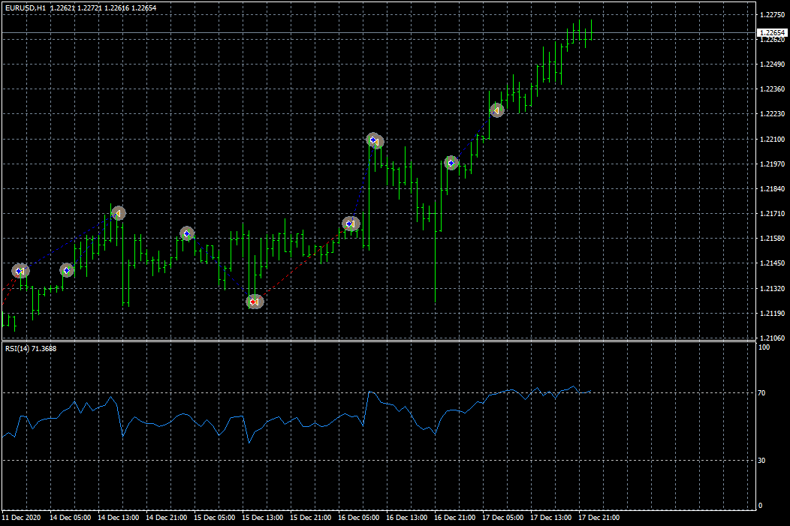

# RSI EA

> Source: https://fxcodebase.com/code/viewtopic.php?f=38&t=70817  
> Forum: 38 · Topic 70817 · 3 post(s)

---

## RSI EA

**Apprentice** · Thu Jan 14, 2021 4:50 am

Based on the request.
[viewtopic.php?f=27&t=70800](https://fxcodebase.com/code/viewtopic.php?f=27&t=70800)

 [RSI EA.mq4](files/140191/RSI%20EA.mq4)

---

## Re: RSI EA

**jonasfx** · Fri Jan 15, 2021 5:30 am

> **Apprentice wrote:**
>
>
> eurusd-h1-fxcm-australia-pty.png
>
>
> Based on the request.
> [viewtopic.php?f=27&t=70800](https://fxcodebase.com/code/viewtopic.php?f=27&t=70800)
>
>
> RSI EA.mq4

---

## Re: RSI EA

**Apprentice** · Fri Jan 15, 2021 6:26 am

Yes, it is.
