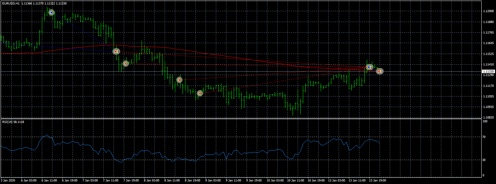
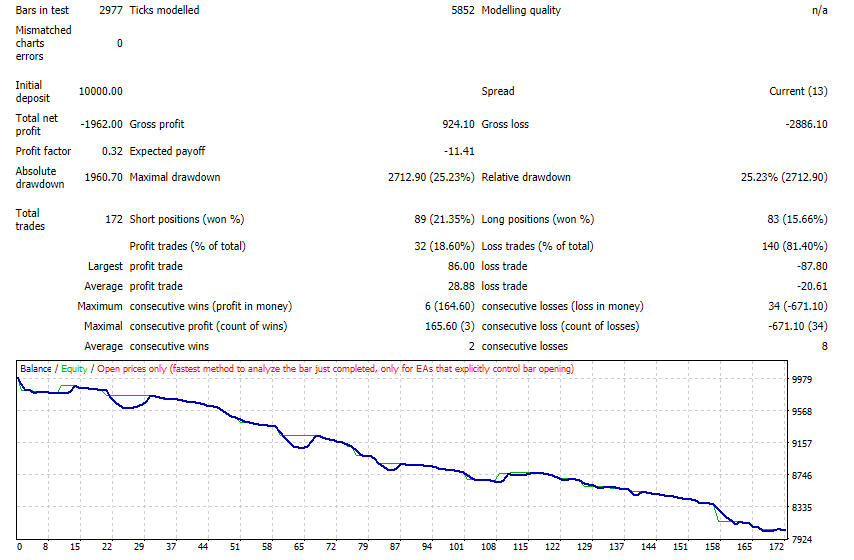
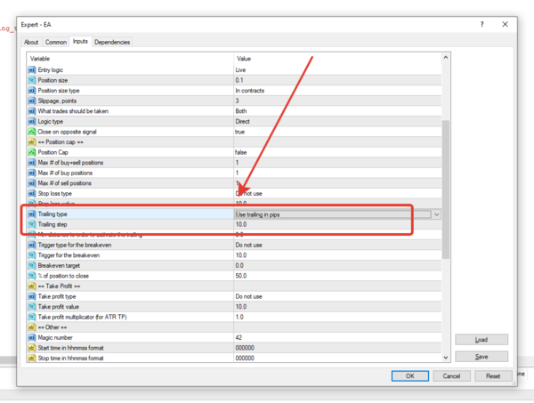

# RSI EMAS

> Source: https://fxcodebase.com/code/viewtopic.php?f=38&t=69642  
> Forum: 38 · Topic 69642 · 4 post(s)

---

## RSI EMAS

**Apprentice** · Thu Apr 09, 2020 7:35 am

 

Based on request.
[viewtopic.php?f=27&t=69614](https://fxcodebase.com/code/viewtopic.php?f=27&t=69614)

 [RSI EMAS in trend EA.mq4](files/132711/RSI%20EMAS%20in%20trend%20EA.mq4)

 [RSI EMAS against trend EA.mq4](files/132711/RSI%20EMAS%20against%20trend%20EA.mq4)

---

## Re: RSI EMAS

**smanna** · Thu Apr 09, 2020 5:46 pm

Hi, so many thanks for the EA , i'm testing it in mt4 but I've a question, I can't set the trailing stop, what can I do?

it can be (more) profitable with trailing stop , thanks!

 

*march tiks*

 

*march*

---

## Re: RSI EMAS

**Apprentice** · Fri Apr 10, 2020 7:00 am

Your request is added to the development list.
Development reference 1045.

---

## Re: RSI EMAS

**Apprentice** · Fri Apr 17, 2020 4:30 am

You need to set this:

 

