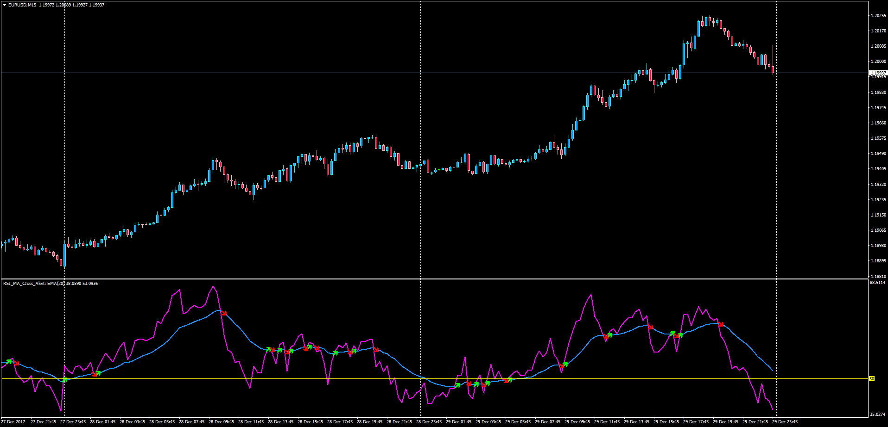

# RSI MA Cross Alert

> Source: https://fxcodebase.com/code/viewtopic.php?f=38&t=65493  
> Forum: 38 · Topic 65493 · 1 post(s)

---

## RSI MA Cross Alert

**Apprentice** · Sun Dec 31, 2017 5:40 am

LUA Original: [viewtopic.php?f=17&t=41176](https://fxcodebase.com/code/viewtopic.php?f=17&t=41176)

Description:

This indicator provides Audio / Email Alerts if and when RSI cross over/under MA of RSI. The original concept was first presented in LUA and this is the MT4 version.

 [RSI_MA_Cross_Alert.mq4](files/116684/RSI_MA_Cross_Alert.mq4)
