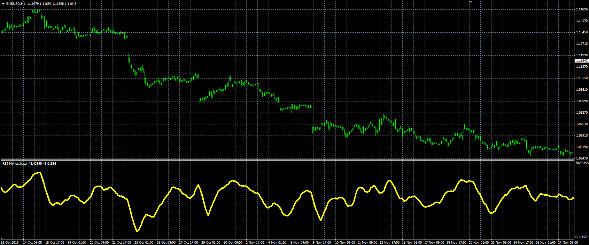

# RSI MA oscillator

> Source: https://fxcodebase.com/code/viewtopic.php?f=38&t=63302  
> Forum: 38 · Topic 63302 · 1 post(s)

---

## RSI MA oscillator

**Alexander.Gettinger** · Fri Mar 25, 2016 5:17 pm

Formula:
RSI_MA = MA(RSI) with [MA_Length] number of periods and [MA_Method] type,
RSI - Relative Strength Index with [RSI_Length] number of periods.

 

Download:

 [RSI_MA.mq4](files/105481/RSI_MA.mq4)
