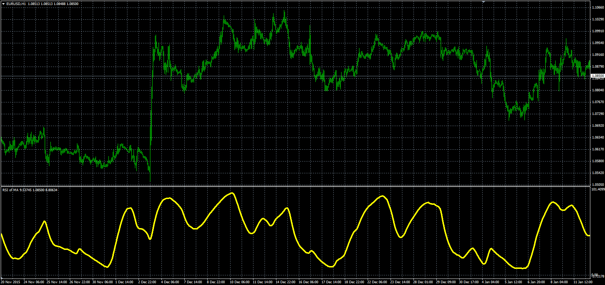

# RSI of MA indicator

> Source: https://fxcodebase.com/code/viewtopic.php?f=38&t=63205  
> Forum: 38 · Topic 63205 · 1 post(s)

---

## RSI of MA indicator

**Alexander.Gettinger** · Wed Mar 02, 2016 1:54 pm

Formula:
MA_RSI=EMA(RSI) with [MA_RSI_Length] number of periods, where
RSI - RSI(MA) with [RSI_Length] number of periods,
MA - EMA(Price) with [MA_Length] number of periods.

 

Download:

 [RSI_Of_MA.mq4](files/105068/RSI_Of_MA.mq4)
