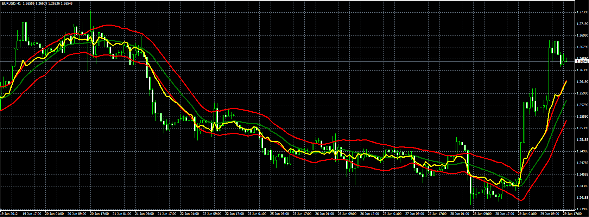

# RSI on chart

> Source: https://fxcodebase.com/code/viewtopic.php?f=38&t=20674  
> Forum: 38 · Topic 20674 · 1 post(s)

---

## RSI on chart

**Alexander.Gettinger** · Fri Jun 29, 2012 1:31 pm

Original indicator: [viewtopic.php?f=17&t=3612](https://fxcodebase.com/code/viewtopic.php?f=17&t=3612)

> Indicator draw RSI oscillator on data chart with RSI levels.
> As center line uses MA.

 

Download:

 [RSI_OnChart.mq4](files/36249/RSI_OnChart.mq4)
